# SOFTWARE ARCHITECTURE & SYSTEM DESIGN
## Sistem Deteksi Tanaman Melon Siap Pangkas (ESP32-CAM + AI)

---

# TAHAP 1 — CONTEXT DIAGRAM

Context diagram menggambarkan batas sistem (system boundary) dan interaksi level tertinggi antara sistem dengan entitas eksternal.

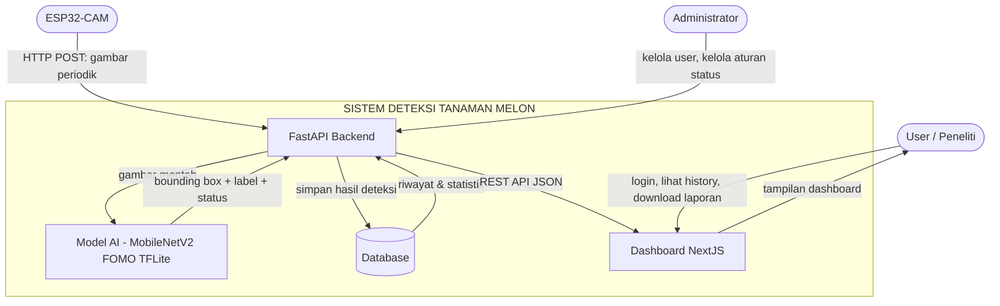

**Penjelasan relasi:**
- **ESP32-CAM** adalah satu-satunya sumber data citra; berkomunikasi searah ke backend via HTTP POST.
- **FastAPI Backend** menjadi orkestrator tunggal: menerima gambar, memanggil Model AI, menyimpan ke Database, dan menyajikan data ke Frontend.
- **Model AI** adalah komponen internal yang dipanggil backend secara sinkron, bukan entitas eksternal yang berdiri sendiri secara jaringan.
- **Administrator** berinteraksi dengan sistem untuk provisioning user dan konfigurasi aturan status pangkas (bukan melalui registrasi publik).
- **User** hanya berinteraksi melalui Dashboard (read-only terhadap proses AI, tidak bisa memicu inferensi manual selain melalui mekanisme yang disediakan).

---

# TAHAP 2 — USE CASE DIAGRAM

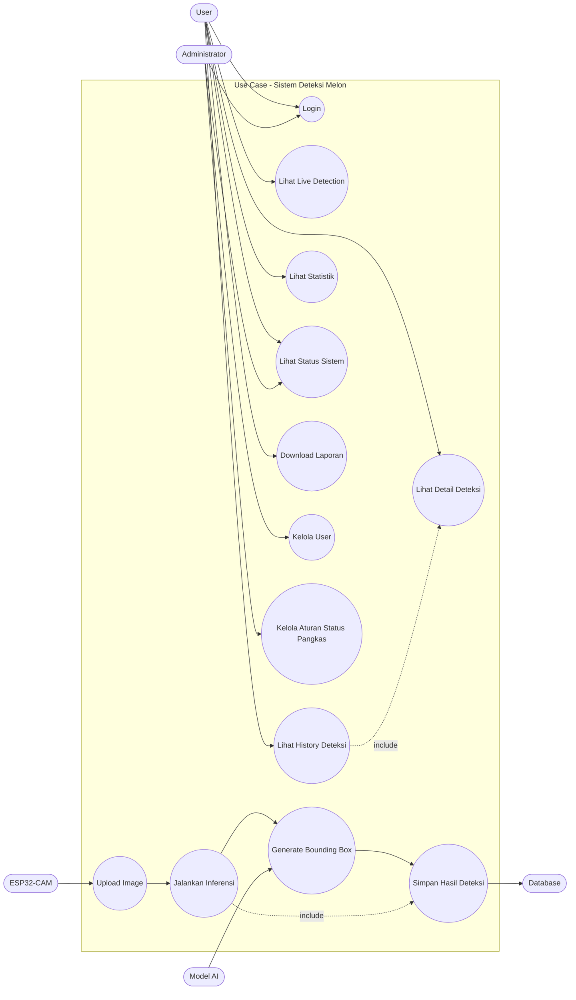

**Catatan use case penting:**
- *Upload Image* hanya dilakukan oleh ESP32-CAM (bukan user) — sesuai requirement, sistem tidak mendukung upload manual oleh user.
- *Jalankan Inferensi* dan *Generate Bounding Box* bersifat otomatis (triggered event), bukan use case yang diinisiasi user.
- *Kelola Aturan Status Pangkas* khusus Administrator, mendukung requirement "aturan harus mudah diubah".
- *Download Laporan* saat ini hanya format TXT, namun use case dirancang generik (`Download Report`) agar dapat diperluas tanpa mengubah relasi use case.

---

# TAHAP 3 — ACTIVITY DIAGRAM

### 3.1 Login

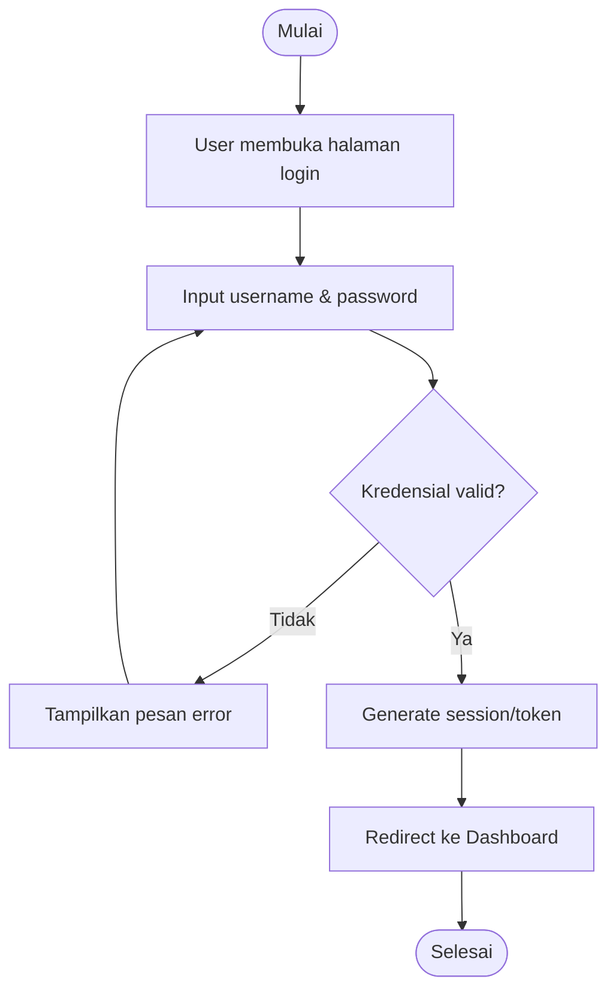

### 3.2 Upload Image (oleh ESP32-CAM)

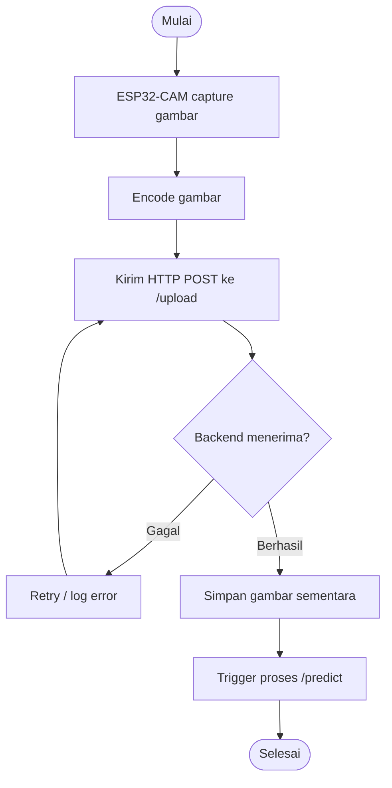

### 3.3 Realtime Detection

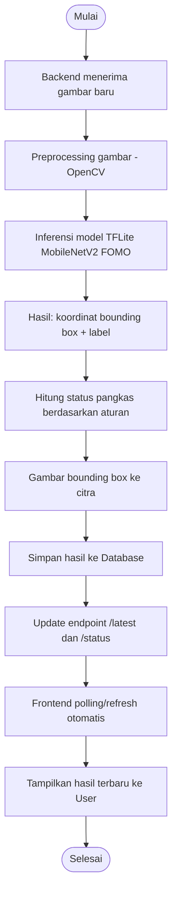

### 3.4 History

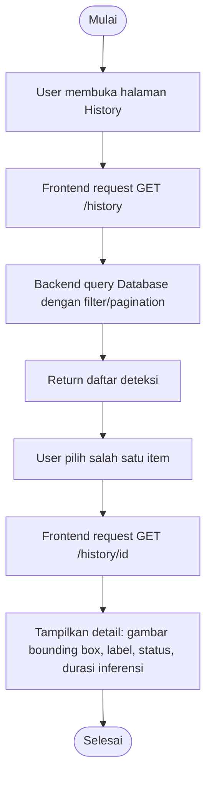

### 3.5 Monitoring

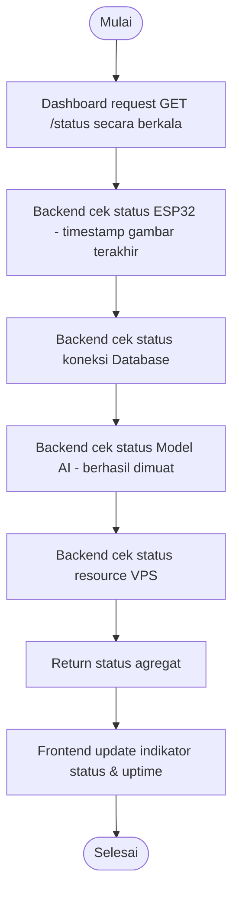

### 3.6 Download Report

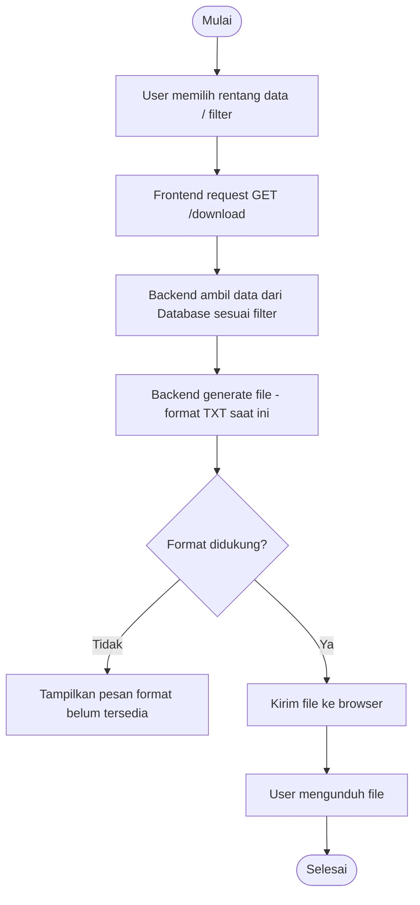

---

# TAHAP 4 — SEQUENCE DIAGRAM

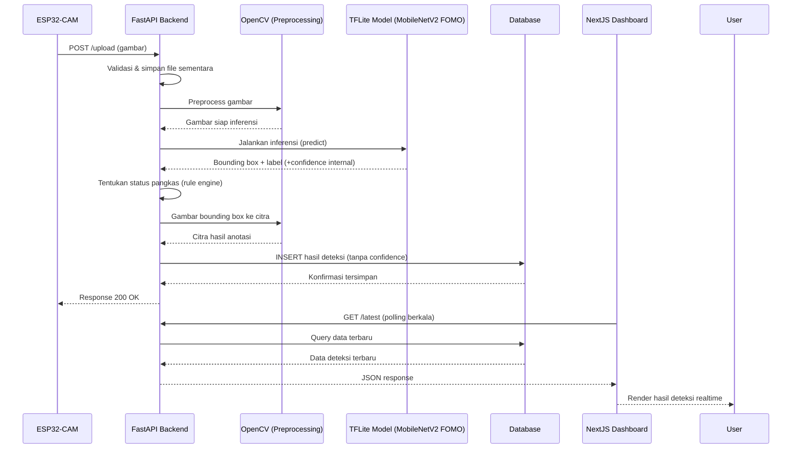

---

# TAHAP 5 — COMPONENT DIAGRAM

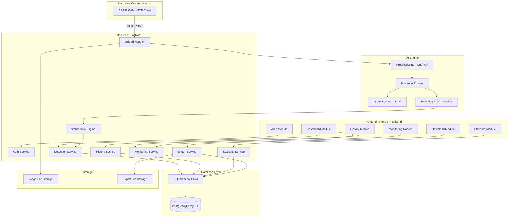

---

# TAHAP 6 — DEPLOYMENT DIAGRAM

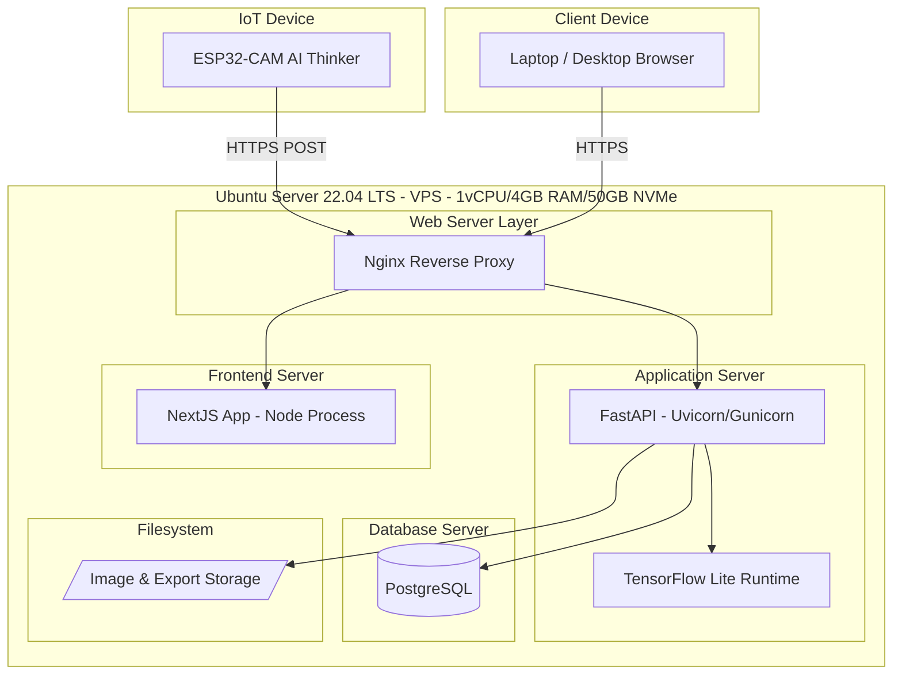

**Catatan deployment:**
- Nginx berfungsi sebagai reverse proxy tunggal yang merutekan trafik ke FastAPI (API) dan NextJS (frontend), sekaligus menangani SSL termination.
- Mengingat spesifikasi VPS terbatas (1 vCPU/4GB RAM), TensorFlow Lite dijalankan dalam proses yang sama dengan FastAPI (in-process inference) untuk menghindari overhead komunikasi antar-proses/container terpisah.
- PostgreSQL dijalankan sebagai service terpisah pada VPS yang sama; konfigurasi koneksi dipisahkan agar dapat dipindah ke MySQL atau instance terpisah tanpa mengubah kode aplikasi.

---

# TAHAP 7 — CLEAN ARCHITECTURE

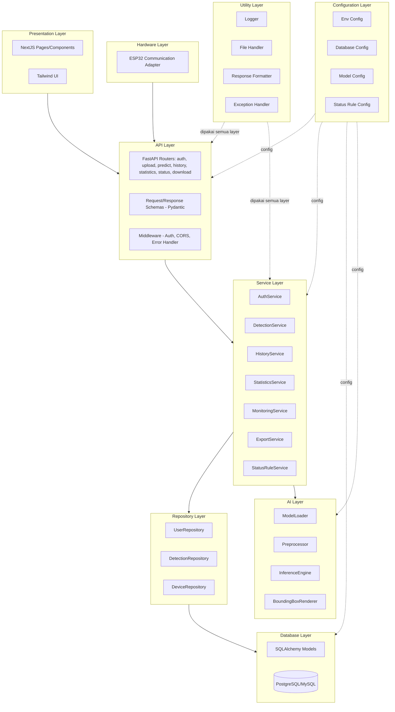

**Prinsip dependency direction:**
- Dependensi mengalir satu arah: Presentation → API → Service → Repository → Database.
- Layer **AI** dan **Hardware** bersifat *pluggable*: Service Layer berkomunikasi dengan AI Layer melalui interface/abstraksi, sehingga model TFLite dapat diganti tanpa mengubah Service Layer.
- Layer **Configuration** tidak bergantung pada layer lain manapun (paling independen), dibaca oleh seluruh layer yang membutuhkan.
- Layer **Utility** bersifat lintas-layer (cross-cutting concern: logging, error handling) dan tidak boleh memiliki dependensi balik ke business logic.
- Repository Layer mengisolasi Service Layer dari detail ORM/SQL, sehingga migrasi PostgreSQL → MySQL hanya menyentuh Database Layer & Configuration Layer.

---

# TAHAP 8 — RANCANGAN KOMUNIKASI DATA

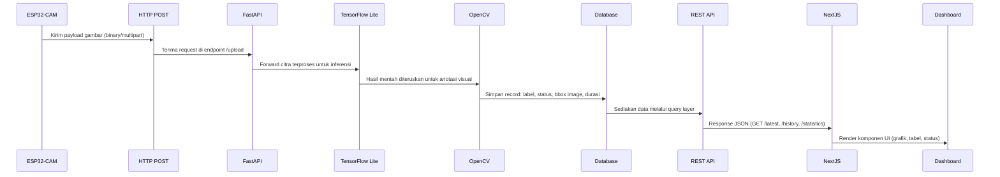

**Format payload (konseptual, bukan kode):**

| Tahap | Format Data |
|---|---|
| ESP32 → FastAPI | `multipart/form-data` berisi binary image + device_id |
| FastAPI → TFLite | Array tensor hasil preprocessing (resize, normalisasi) |
| TFLite → OpenCV | Koordinat bounding box + label index |
| FastAPI → Database | Record terstruktur (JSON-serializable, sesuai skema History) |
| FastAPI → NextJS | `application/json` REST response |
| NextJS → Dashboard | Props/state React untuk rendering komponen |

**Mekanisme realtime (tanpa streaming):**
Frontend melakukan *short-interval polling* (mis. setiap beberapa detik) terhadap endpoint `/latest` dan `/status`, bukan koneksi persisten (WebSocket/SSE), sesuai requirement bahwa sistem tidak menggunakan video streaming.

---

# TAHAP 9 — STRUKTUR FOLDER PROJECT

```
deteksi-melon/
│
├── frontend/                      # NextJS + Tailwind + TypeScript
│   ├── src/
│   │   ├── app/                   # Routing (App Router)
│   │   ├── components/            # UI Components
│   │   ├── modules/                # Dashboard, History, Statistics, Monitoring, Auth
│   │   ├── services/                # API client (fetch wrapper)
│   │   ├── types/                   # TypeScript interfaces
│   │   └── styles/                  # Tailwind config & global styles
│   ├── public/
│   └── package.json
│
├── backend/                       # FastAPI
│   ├── app/
│   │   ├── api/                     # Routers: auth, upload, predict, history, statistics, status, download
│   │   ├── services/                # Business logic layer
│   │   ├── repositories/            # Data access layer
│   │   ├── schemas/                 # Pydantic models
│   │   ├── core/                    # Config, security, middleware
│   │   ├── utils/                   # Logger, file handler, formatter
│   │   └── hardware/                # ESP32 communication adapter
│   ├── tests/
│   └── requirements.txt
│
├── ai-model/                      # Terpisah agar mudah diganti
│   ├── models/
│   │   └── mobilenetv2_fomo.lite
│   ├── inference/                  # ModelLoader, Preprocessor, InferenceEngine
│   ├── labels.yaml                 # Definisi label & status rule
│   └── version.txt
│
├── database/
│   ├── migrations/                 # Alembic migration scripts
│   ├── models/                     # SQLAlchemy ORM models
│   └── seeders/                    # Data awal (admin user, dsb.)
│
├── deployment/
│   ├── nginx/
│   ├── systemd/                    # Service files FastAPI & NextJS
│   ├── scripts/                    # Backup, deploy, restart scripts
│   └── env/                        # .env templates per environment
│
├── documentation/
│   ├── architecture/               # Diagram-diagram desain (file ini)
│   ├── api-spec/                   # OpenAPI/Swagger export
│   └── srs/                        # Software Requirement Specification
│
└── assets/
    ├── sample-images/
    └── design-references/
```

**Rasional pemisahan folder:**
- `ai-model/` dipisah total dari `backend/` agar model dapat diperbarui (versi baru hasil training ulang) tanpa menyentuh kode aplikasi — backend cukup membaca path model dari konfigurasi.
- `database/migrations/` terpisah dari `database/models/` agar histori perubahan skema dapat dilacak independen dari definisi model saat ini.
- `deployment/env/` menyimpan template konfigurasi koneksi database (PostgreSQL/MySQL) sehingga perpindahan database cukup mengganti file environment, bukan kode.

---

# TAHAP 10 — SOFTWARE DEVELOPMENT FLOW

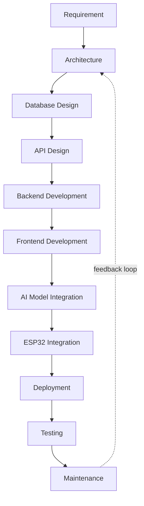

| Tahap | Deliverable Utama |
|---|---|
| Requirement | SRS (sudah selesai pada dokumen sebelumnya) |
| Architecture | Dokumen ini — context, use case, activity, sequence, component, deployment, clean architecture |
| Database Design | ERD, skema tabel, migration plan |
| API Design | OpenAPI spec untuk seluruh endpoint (login, upload, predict, history, statistics, status, latest, download) |
| Backend Development | Implementasi Service & Repository Layer sesuai Clean Architecture |
| Frontend Development | Implementasi Dashboard, History, Statistics, Monitoring sesuai komponen NextJS |
| AI Model Integration | Integrasi MobileNetV2 FOMO TFLite ke Inference Engine |
| ESP32 Integration | Implementasi firmware komunikasi HTTP POST dari sisi hardware |
| Deployment | Setup VPS, Nginx, systemd service, SSL |
| Testing | Unit test (service layer), integration test (API), end-to-end test (ESP32 → Dashboard) |
| Maintenance | Monitoring, backup berkala, update model, bug fixing |

---

*Dokumen ini merupakan hasil Tahap Desain Arsitektur. Implementasi (source code) belum dimulai sesuai instruksi.*
