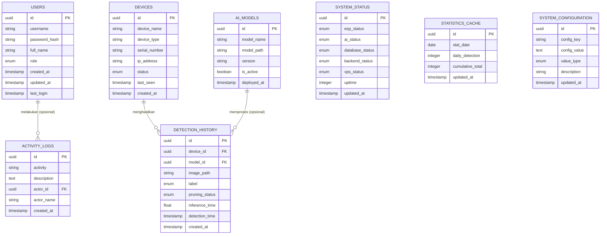
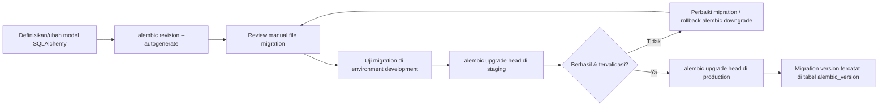

# DATABASE SPECIFICATION & ERD
## Sistem Deteksi Tanaman Melon Siap Pangkas

Acuan: SRS & Software Architecture (dokumen sebelumnya). Tidak ada requirement yang diubah.

---

# 1. ANALISIS KEBUTUHAN DATA

### 1.1 Klasifikasi Data

| Kategori | Tabel | Karakteristik |
|---|---|---|
| **Master Data** | `users`, `devices`, `ai_models` | Jarang berubah, menjadi rujukan tabel lain |
| **Transactional Data** | `detection_history` | Bertambah terus-menerus, dihasilkan dari proses inferensi realtime |
| **Log Data** | `activity_logs`, `system_status` | Bersifat append-only, untuk audit trail & monitoring historis |
| **Cache/Derived Data** | `statistics_cache` | Hasil agregasi, dihitung ulang dari `detection_history`, bukan sumber kebenaran utama |
| **Configuration Data** | `system_configuration` | Key-value, mengatur perilaku sistem tanpa redeploy |

### 1.2 Entitas Tambahan yang Direkomendasikan

Selain 7 tabel minimal pada requirement, ditambahkan **1 tabel opsional**:

**`ai_models`** — menyimpan metadata versi model AI (nama model, path file `.lite`, versi, status aktif, tanggal deploy).

*Alasan:* Requirement "Future Scalability" eksplisit menyebut **Multi Model AI**. Tanpa tabel ini, mengganti/menambah model akan memaksa perubahan skema `detection_history` (menambah kolom model). Dengan `ai_models`, kolom `model_id` pada `detection_history` cukup ditambahkan sebagai foreign key nullable sejak awal — tidak mengubah struktur inti saat fitur multi-model benar-benar dibutuhkan.

---

# 2. DAFTAR TABEL

| No | Nama Tabel (plural, snake_case) | Model ORM (singular) | Kategori |
|---|---|---|---|
| 1 | `users` | `User` | Master |
| 2 | `devices` | `Device` | Master |
| 3 | `ai_models` | `AiModel` | Master (opsional) |
| 4 | `detection_history` | `DetectionHistory` | Transaksi |
| 5 | `activity_logs` | `ActivityLog` | Log |
| 6 | `system_status` | `SystemStatus` | Log |
| 7 | `statistics_cache` | `StatisticsCache` | Cache |
| 8 | `system_configuration` | `SystemConfiguration` | Konfigurasi |

---

# 3. PENJELASAN SETIAP TABEL

### 3.1 `users`
Menyimpan akun pengguna sistem (Administrator & User). Tidak ada registrasi publik — seluruh baris dibuat manual oleh Administrator.

| Kolom | Tipe (konseptual) | Keterangan |
|---|---|---|
| id | UUID | Primary Key |
| username | String(50) | Unik, dipakai login |
| password_hash | String(255) | Hash (bukan plaintext) |
| full_name | String(100) | Nama lengkap |
| role | Enum(`admin`,`user`) | Kontrol akses |
| created_at | Timestamp | Waktu dibuat |
| updated_at | Timestamp | Waktu update terakhir |
| last_login | Timestamp (nullable) | Audit login terakhir |

### 3.2 `devices`
Menyimpan identitas setiap unit ESP32-CAM yang terdaftar. Mendukung requirement "Future Scalability: Multi Device" sejak awal.

| Kolom | Tipe | Keterangan |
|---|---|---|
| id | UUID | Primary Key |
| device_name | String(100) | Nama identifikasi (mis. "ESP32-Greenhouse-1") |
| device_type | String(50) | Mis. "ESP32-CAM AI Thinker" |
| serial_number | String(100) | Unik, identitas fisik perangkat |
| ip_address | String(45) | IPv4/IPv6 perangkat dalam jaringan |
| status | Enum(`online`,`offline`,`unknown`) | Status terkini |
| last_seen | Timestamp (nullable) | Waktu request terakhir diterima |
| created_at | Timestamp | Waktu registrasi perangkat |

### 3.3 `ai_models` (tambahan)

| Kolom | Tipe | Keterangan |
|---|---|---|
| id | UUID | Primary Key |
| model_name | String(100) | Mis. "MobileNetV2 FOMO" |
| model_path | String(255) | Path file `.lite` |
| version | String(20) | Versi model |
| is_active | Boolean | Model yang sedang digunakan backend |
| deployed_at | Timestamp | Waktu model diaktifkan |

### 3.4 `detection_history`
Tabel transaksi inti. Menyimpan setiap hasil deteksi. **Confidence tidak disimpan**, sesuai requirement.

| Kolom | Tipe | Keterangan |
|---|---|---|
| id | UUID | Primary Key |
| device_id | UUID | Foreign Key → `devices.id` |
| model_id | UUID (nullable) | Foreign Key → `ai_models.id` |
| image_path | String(255) | Path gambar hasil bounding box |
| label | Enum(`tunas_air`,`buah_tidak_siap`,`buah_siap`,`daun_tidak_siap`,`daun_siap`) | Hasil klasifikasi |
| pruning_status | Enum(`siap_pangkas`,`belum_siap_pangkas`) | Hasil rule engine |
| inference_time | Float (ms) | Durasi inferensi |
| detection_time | Timestamp | Waktu gambar diambil/dideteksi |
| created_at | Timestamp | Waktu record disimpan |

### 3.5 `activity_logs`
Audit trail seluruh aktivitas penting sistem (login, perubahan konfigurasi, perubahan aturan status, dsb).

| Kolom | Tipe | Keterangan |
|---|---|---|
| id | UUID | Primary Key |
| activity | String(100) | Jenis aktivitas, mis. "LOGIN", "UPDATE_CONFIG" |
| description | Text | Detail aktivitas |
| actor_id | UUID (nullable) | Foreign Key → `users.id` (null jika aktivitas sistem/otomatis) |
| actor_name | String(100) | Snapshot nama aktor — tetap valid meski user dihapus |
| created_at | Timestamp | Waktu kejadian |

### 3.6 `system_status`
Disimpan sebagai **snapshot historis** (bukan single-row), agar mendukung perhitungan uptime dan tren status, bukan hanya kondisi "saat ini".

| Kolom | Tipe | Keterangan |
|---|---|---|
| id | UUID | Primary Key |
| esp_status | Enum(`online`,`offline`) | Status agregat seluruh ESP32 terdaftar |
| ai_status | Enum(`ready`,`error`) | Status model AI |
| database_status | Enum(`connected`,`disconnected`) | Status koneksi DB |
| backend_status | Enum(`running`,`down`) | Status proses FastAPI |
| vps_status | Enum(`healthy`,`warning`,`critical`) | Status resource VPS |
| uptime | Integer (detik) | Uptime backend saat snapshot diambil |
| updated_at | Timestamp | Waktu snapshot |

*Catatan:* Dashboard cukup mengambil baris dengan `updated_at` terbaru (`ORDER BY updated_at DESC LIMIT 1`) untuk status real-time, sementara baris-baris lama tetap berguna untuk grafik historis status sistem di masa depan.

### 3.7 `statistics_cache`
**Alasan penggunaan cache statistik:**
Menghitung `total_detection`, deteksi harian, dan mingguan langsung dari `detection_history` setiap kali dashboard dibuka akan memerlukan agregasi (`COUNT`, `GROUP BY`) atas tabel transaksi yang terus bertumbuh — mahal secara komputasi jika dilakukan berulang pada setiap request, terutama pada VPS dengan resource terbatas (1 vCPU/4GB RAM). Tabel cache ini diperbarui secara periodik/incremental (mis. setiap kali ada insert baru ke `detection_history`, atau via scheduled job), sehingga endpoint `/statistics` cukup membaca tabel kecil ini tanpa agregasi berat.

Dirancang sebagai **agregat per-tanggal** (bukan satu baris tunggal) agar dapat menyediakan data untuk grafik harian/mingguan secara historis, bukan hanya angka hari ini.

| Kolom | Tipe | Keterangan |
|---|---|---|
| id | UUID | Primary Key |
| stat_date | Date | Tanggal agregasi (unik per tanggal) |
| daily_detection | Integer | Jumlah deteksi pada tanggal tsb |
| cumulative_total | Integer | Total deteksi kumulatif s.d. tanggal tsb |
| updated_at | Timestamp | Waktu cache terakhir diperbarui |

*Grafik mingguan diturunkan dengan menjumlahkan 7 baris `stat_date` terakhir pada level aplikasi, tanpa perlu tabel terpisah.*

### 3.8 `system_configuration`
Dirancang sebagai **key-value store**, bukan kolom tetap, agar parameter baru dapat ditambahkan tanpa mengubah skema (`ALTER TABLE`) — mendukung "Future Scalability" tanpa migrasi struktural berulang.

| Kolom | Tipe | Keterangan |
|---|---|---|
| id | UUID | Primary Key |
| config_key | String(100) | Unik, mis. `refresh_interval`, `upload_interval`, `max_file_size`, `system_name`, `pruning_rule_labels` |
| config_value | Text | Nilai konfigurasi (disimpan sebagai string, di-parse sesuai `value_type`) |
| value_type | Enum(`string`,`integer`,`boolean`,`json`) | Petunjuk parsing nilai |
| description | String(255) | Penjelasan kegunaan konfigurasi |
| updated_at | Timestamp | Waktu update terakhir |

---

# 4. ENTITY RELATIONSHIP DIAGRAM (ERD)

*Catatan: `SYSTEM_STATUS`, `STATISTICS_CACHE`, dan `SYSTEM_CONFIGURATION` tidak memiliki relasi langsung (foreign key) ke tabel lain — keduanya bersifat independen (log snapshot, cache agregat, dan key-value config).*

---

# 5. RELASI ANTAR TABEL

| Relasi | Jenis | Penjelasan |
|---|---|---|
| `devices` → `detection_history` | **One-to-Many** | Satu device menghasilkan banyak record deteksi sepanjang waktu |
| `ai_models` → `detection_history` | **One-to-Many** (nullable) | Satu versi model dapat menghasilkan banyak deteksi; kolom nullable agar kompatibel jika sistem belum mengaktifkan multi-model |
| `users` → `activity_logs` | **One-to-Many** (nullable) | Satu user dapat memicu banyak log aktivitas; nullable untuk log yang dipicu sistem otomatis (mis. ESP32 timeout) |
| `detection_history` → `devices` | **Many-to-One** | Kebalikan relasi pertama, dilihat dari sisi tabel transaksi |
| `activity_logs` → `users` | **Many-to-One** | Kebalikan relasi kedua |

### Mengapa tidak ada relasi Many-to-Many?

Tidak ditemukan kebutuhan Many-to-Many pada cakupan sistem saat ini:
- **User ↔ Device**: Dashboard bersifat *shared monitoring* — seluruh user dengan akses login dapat melihat seluruh device, tidak ada kepemilikan/penugasan device per user. Jika di masa depan dibutuhkan pembatasan akses per device per user, dapat ditambahkan tabel junction `user_device_access` tanpa mengubah struktur tabel inti yang sudah ada (selaras dengan prinsip Future Scalability).
- **Detection ↔ Label**: Satu record deteksi hanya memiliki satu label (hasil klasifikasi tunggal per gambar), sehingga cukup disimpan sebagai kolom `enum`, bukan relasi many-to-many ke tabel `labels` terpisah.

---

# 6. NORMALISASI

### 1NF (First Normal Form)
Seluruh kolom bernilai atomic — tidak ada kolom yang menyimpan multiple values (mis. `label` adalah satu nilai enum tunggal per baris, bukan array/list label). Tidak ada repeating group (mis. tidak ada kolom `label_1`, `label_2`, dst).

### 2NF (Second Normal Form)
Seluruh tabel menggunakan **single-column surrogate primary key** (`id` UUID), sehingga secara definisi tidak ada *partial dependency* (yang hanya mungkin terjadi pada composite primary key). Seluruh atribut non-key bergantung penuh pada `id`.

### 3NF (Third Normal Form)
Tidak ada *transitive dependency*. Contoh penerapan:
- `detection_history` tidak menyimpan `device_name` atau `ip_address` secara langsung — data tersebut hanya dapat diakses melalui `device_id` yang merujuk ke `devices`. Jika nama device diubah, tidak perlu update massal pada `detection_history`.
- `activity_logs.actor_name` adalah **snapshot yang disengaja** (bukan pelanggaran 3NF), bukan untuk redundansi data aktif, melainkan untuk menjaga integritas riwayat log meski `users.full_name` berubah atau user dihapus — ini merupakan praktik umum *audit log design*, bukan normalisasi atribut transaksional.

---

# 7. PRIMARY KEY

| Tabel | Primary Key |
|---|---|
| users | id (UUID) |
| devices | id (UUID) |
| ai_models | id (UUID) |
| detection_history | id (UUID) |
| activity_logs | id (UUID) |
| system_status | id (UUID) |
| statistics_cache | id (UUID) |
| system_configuration | id (UUID) |

*UUID dipilih (bukan auto-increment integer) karena: (1) portabel antara PostgreSQL dan MySQL tanpa perbedaan perilaku sequence, (2) tidak membocorkan jumlah data melalui ID berurutan, (3) memudahkan sinkronisasi data di masa depan jika sistem berkembang ke multi-server/cloud.*

---

# 8. FOREIGN KEY

| Tabel | Kolom FK | Mereferensi | Nullable | On Delete |
|---|---|---|---|---|
| detection_history | device_id | devices.id | Tidak | RESTRICT (device tidak boleh dihapus jika punya riwayat) |
| detection_history | model_id | ai_models.id | Ya | SET NULL |
| activity_logs | actor_id | users.id | Ya | SET NULL |

---

# 9. INDEX

| Tabel | Kolom | Jenis Index | Alasan |
|---|---|---|---|
| users | username | UNIQUE INDEX | Pencarian saat login, harus unik |
| devices | serial_number | UNIQUE INDEX | Identitas fisik unik per perangkat |
| devices | status | INDEX | Filter cepat untuk monitoring online/offline |
| detection_history | device_id | INDEX | Filter riwayat per device |
| detection_history | created_at | INDEX | Query history/statistics berbasis rentang waktu (paling sering digunakan) |
| detection_history | label | INDEX | Filter & agregasi berdasarkan label |
| detection_history | pruning_status | INDEX | Filter status siap/belum siap pangkas |
| activity_logs | created_at | INDEX | Query log berbasis waktu |
| activity_logs | actor_id | INDEX | Filter log per user |
| statistics_cache | stat_date | UNIQUE INDEX | Satu baris per tanggal, lookup cepat untuk grafik |
| system_configuration | config_key | UNIQUE INDEX | Lookup konfigurasi by key |

---

# 10. NAMING CONVENTION

| Aturan | Penerapan |
|---|---|
| Nama tabel | `snake_case`, bentuk **plural** (mis. `users`, `detection_history`) |
| Nama model ORM | `PascalCase`, bentuk **singular** (mis. `User`, `DetectionHistory`) |
| Nama kolom | `snake_case` (mis. `device_id`, `pruning_status`) |
| Timestamp | konsisten `created_at` dan `updated_at` di seluruh tabel yang relevan |
| Foreign Key | `<nama_tabel_singular>_id` (mis. `device_id`, `model_id`, `actor_id`) |
| Enum value | `snake_case` huruf kecil (mis. `siap_pangkas`, `belum_siap_pangkas`) |

---

# 11. IMAGE STORAGE STRATEGY

**Keputusan: gambar TIDAK disimpan sebagai BLOB di database — hanya `image_path` yang disimpan.**

Alasan:
1. **Performa database** — Menyimpan binary besar (BLOB) di dalam baris tabel transaksional memperlambat query, index, dan replikasi, terutama pada tabel `detection_history` yang terus bertumbuh secara realtime.
2. **Ukuran backup** — Backup database mingguan akan membengkak drastis jika berisi ribuan gambar; memisahkan storage membuat backup database tetap ringan dan cepat, sementara backup gambar dapat dikelola dengan strategi terpisah (mis. rsync incremental).
3. **Web serving efisien** — File gambar dapat disajikan langsung oleh Nginx (static file serving) tanpa melalui aplikasi/database, jauh lebih cepat dibanding query BLOB lalu stream dari backend.
4. **Kompatibilitas lintas database** — Penanganan tipe BLOB berbeda antara PostgreSQL (`bytea`) dan MySQL (`BLOB`), berpotensi menyulitkan portabilitas ORM. Path string (`VARCHAR`) identik perilakunya di kedua database.
5. **Kesiapan migrasi ke cloud storage** — Sesuai requirement Future Scalability, jika nantinya gambar dipindah ke cloud storage (S3-compatible), cukup mengubah format nilai `image_path` (dari path lokal menjadi URL) tanpa mengubah struktur tabel sama sekali.

---

# 12. BACKUP STRATEGY

| Aspek | Strategi |
|---|---|
| **Frekuensi** | Backup penuh (full dump) database dilakukan **mingguan**, dijadwalkan via cron pada jam beban rendah |
| **Cakupan** | Backup database (skema + data) terpisah dari backup folder image storage |
| **Lokasi** | Disimpan di luar VPS utama (mis. object storage terpisah atau disk snapshot provider VPS), tidak hanya di disk yang sama dengan database aktif |
| **Retention Policy** | Simpan 4 backup mingguan terakhir (1 bulan rolling) + 1 backup bulanan untuk 3 bulan terakhir; backup lebih lama dihapus otomatis |
| **Restore Strategy** | Dilakukan uji restore berkala (mis. setiap bulan) ke environment staging untuk memastikan file backup valid dan proses restore terdokumentasi dan teruji, bukan hanya diasumsikan berhasil |
| **Snapshot tambahan** | Memanfaatkan fitur *Weekly Backup* dan *Snapshot* bawaan VPS (sudah tercantum di spesifikasi VPS) sebagai lapisan proteksi tambahan di tingkat infrastruktur, di luar backup logical database |

---

# 13. MIGRATION STRATEGY

Menggunakan **Alembic** sebagai migration tool resmi SQLAlchemy.

Alur migrasi:

Prinsip yang diterapkan:
- Setiap migration **versioned** dan bersifat **incremental** — tidak pernah mengedit file migration yang sudah diterapkan ke production; perubahan lanjutan dibuat sebagai migration baru.
- Migration diuji terlebih dahulu di environment development/staging sebelum diterapkan ke production VPS.
- Penamaan file migration deskriptif (mis. `add_model_id_to_detection_history`) agar histori perubahan skema mudah ditelusuri.
- Karena seluruh tipe kolom dirancang generik (UUID sebagai string portable, Enum, Timestamp, Text), proses migrasi tetap konsisten baik dijalankan di atas PostgreSQL maupun MySQL.

---

# 14. FUTURE SCALABILITY

| Kebutuhan Masa Depan | Bagaimana Struktur Saat Ini Mendukung |
|---|---|
| **Multi Device** | Sudah didukung sejak awal — `devices` adalah tabel independen, `detection_history` sudah berelasi via `device_id`. Tinggal menambah baris baru. |
| **Multi User** | Sudah didukung — `users.role` membedakan akses; penambahan user baru tidak memerlukan perubahan skema. |
| **Multi Model AI** | Sudah diantisipasi via tabel `ai_models` + `detection_history.model_id` (nullable sejak awal). |
| **Export PDF / Excel** | Tidak memerlukan perubahan skema — data sumber (`detection_history`) sudah terstruktur; hanya menambah service layer baru di backend yang membaca data yang sama. |
| **Notification / Email** | Dapat ditambahkan sebagai tabel baru independen (mis. `notification_logs`) tanpa mengubah tabel inti yang sudah ada. |
| **Mobile Apps** | Tidak memerlukan perubahan database — mobile apps akan mengonsumsi REST API yang sama; perubahan hanya terjadi di layer presentasi/client. |
| **Cloud Storage** | Hanya mengubah format nilai pada kolom `image_path` (path lokal → URL cloud); tipe kolom tetap `String`, tidak perlu migration struktural. |
| **User-Device Access Control** | Jika diperlukan pembatasan akses per device, cukup menambah tabel junction `user_device_access` (Many-to-Many) tanpa mengubah tabel `users` maupun `devices` yang sudah ada. |

---

*Dokumen ini merupakan hasil Tahap Database Specification & ERD. Belum ada SQL maupun kode SQLAlchemy yang dibuat, sesuai instruksi.*
