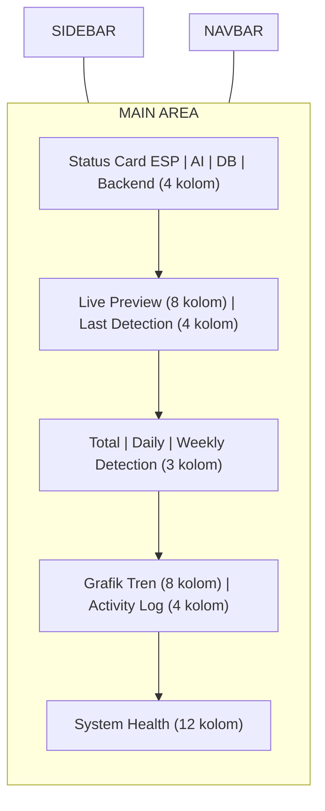
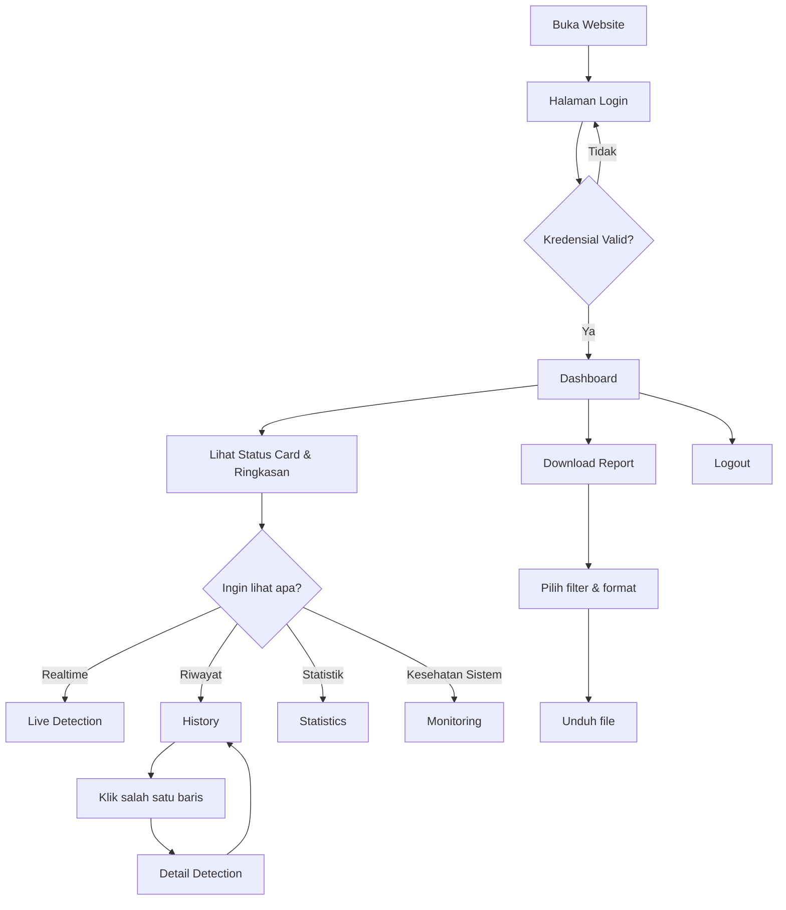

# UI/UX SPECIFICATION & DESIGN SYSTEM
## Sistem Deteksi Tanaman Melon Siap Pangkas

Acuan: 01_SRS.md, 02_Architecture.md, 03_Database.md, 04_API.md. Tidak ada requirement yang diubah. Dokumen ini adalah blueprint desain — belum berisi kode React/Tailwind.

---

# 1. DESIGN PHILOSOPHY

### 1.1 Prinsip Utama
Sistem ini digunakan oleh mahasiswa peneliti untuk memantau proses deteksi yang berjalan otomatis di latar belakang. Pengguna tidak butuh dekorasi berlebihan — mereka butuh **membaca informasi secepat mungkin** dan **memastikan sistem berjalan normal**. Maka filosofi desain yang dipilih:

| Prinsip | Penerapan |
|---|---|
| **Clarity over decoration** | Setiap elemen visual punya fungsi informasi, bukan estetika semata |
| **Scan-ability** | Status (online/offline, siap/belum siap) harus dapat dibaca dalam <1 detik melalui warna & ikon, tanpa perlu membaca teks |
| **Predictability** | Pola layout konsisten di seluruh halaman (sidebar tetap, posisi status card tetap) agar pengguna tidak perlu belajar ulang antar halaman |
| **Calm monitoring, not alarm fatigue** | Warna danger/warning hanya dipakai untuk kondisi yang benar-benar butuh perhatian, bukan dekorasi umum |
| **Pertanian Modern** | Nuansa hijau sebagai identitas domain (pertanian/agritech), dipadukan dengan estetika dashboard SaaS modern — bukan tema "petani tradisional" yang kontras dengan teknologi AI yang dipakai |

### 1.2 Target Pengguna
Mahasiswa peneliti (teknis, familiar dengan dashboard), bukan pengguna awam. Asumsi ini membuka ruang menampilkan data teknis (durasi inferensi, status komponen sistem) secara langsung tanpa perlu disederhanakan berlebihan.

---

# 2. DESIGN SYSTEM

## 2.1 Color Palette

| Token | Hex | Alasan Pemilihan |
|---|---|---|
| **Primary** | `#16A34A` (green-600) | Hijau identitas pertanian/agritech; cukup gelap untuk kontras teks putih di atasnya (tombol, link aktif) |
| **Primary Dark** | `#15803D` (green-700) | Hover/active state dari primary |
| **Primary Light** | `#DCFCE7` (green-100) | Background badge/highlight ringan bernuansa hijau (mis. badge "Siap Pangkas") |
| **Secondary** | `#0F172A` (slate-900) | Warna gelap netral untuk elemen sekunder (sidebar, teks penting) — kontras dengan hijau tanpa bersaing secara visual |
| **Success** | `#22C55E` (green-500) | Status online/sukses — sengaja dibedakan dari Primary agar status "online" tidak campur makna dengan brand color |
| **Warning** | `#F59E0B` (amber-500) | Status perlu perhatian (mis. VPS resource tinggi), warna amber dipilih karena tidak terlalu agresif seperti merah namun tetap mencolok |
| **Danger** | `#EF4444` (red-500) | Status offline/error/kegagalan sistem |
| **Info** | `#3B82F6` (blue-500) | Notifikasi informasional netral, tidak terkait status baik/buruk |
| **Background** | `#F8FAFC` (slate-50) | Latar halaman, cukup terang agar card/konten terlihat menonjol tanpa silau |
| **Surface** | `#FFFFFF` | Warna card/panel, kontras jelas terhadap background |
| **Border** | `#E2E8F0` (slate-200) | Pemisah antar elemen, cukup halus agar tidak mendominasi |
| **Text Primary** | `#0F172A` (slate-900) | Teks utama, kontras tinggi terhadap background terang (WCAG AA) |
| **Text Secondary** | `#64748B` (slate-500) | Teks sekunder/caption, cukup kontras namun secara visual lebih ringan dari teks utama |

**Catatan penggunaan warna status (penting untuk konsistensi):**
- `Siap Pangkas` → Success (hijau)
- `Belum Siap Pangkas` → Warning (amber) — bukan danger, karena ini bukan kondisi error, hanya status normal yang menunggu
- Status komponen sistem (`online/ready/connected/running/healthy`) → Success
- Status komponen sistem (`offline/error/disconnected/down/critical`) → Danger

## 2.2 Typography

| Aspek | Spesifikasi |
|---|---|
| Font utama | **Inter** (fallback: `system-ui, sans-serif`) — dipilih karena keterbacaan tinggi pada ukuran kecil (cocok untuk tabel data padat) dan dukungan tabular numbers untuk angka statistik |
| H1 | 32px / 2rem, weight 700, line-height 1.25 — judul halaman utama |
| H2 | 24px / 1.5rem, weight 600, line-height 1.3 — judul section dalam halaman |
| H3 | 20px / 1.25rem, weight 600, line-height 1.35 — judul card |
| H4 | 18px / 1.125rem, weight 600, line-height 1.4 |
| H5 | 16px / 1rem, weight 600, line-height 1.4 |
| H6 | 14px / 0.875rem, weight 600, line-height 1.4 — label kecil/uppercase |
| Body | 14px / 0.875rem, weight 400, line-height 1.6 — teks default tabel & paragraf |
| Body Large | 16px / 1rem, weight 400, line-height 1.6 — deskripsi/konten utama |
| Caption | 12px / 0.75rem, weight 400, line-height 1.5 — timestamp, metadata |
| Button | 14px / 0.875rem, weight 500, line-height 1 |

## 2.3 Icon System

**Rekomendasi: Lucide React**

Alasan:
1. Sudah tersedia dan terverifikasi kompatibel dalam ekosistem React/NextJS yang dipakai proyek ini.
2. Gaya ikon *outline/stroke* konsisten dengan tema "modern minimalis dashboard" — tidak terlalu dekoratif, sejalan dengan filosofi clarity-over-decoration.
3. Tersedia ikon spesifik kebutuhan domain (`Leaf`, `Camera`, `Activity`, `Database`, `Wifi`, `WifiOff`, `AlertTriangle`, `CheckCircle`) yang relevan untuk dashboard pertanian + monitoring sistem.
4. Tree-shakable per-icon import, baik untuk performa pada VPS dengan resource terbatas.

## 2.4 Spacing System

Menggunakan skala 4px sebagai basis (selaras dengan default spacing scale Tailwind, memudahkan implementasi langsung tanpa konfigurasi kustom berlebihan).

| Token | Nilai | Penggunaan |
|---|---|---|
| `space-1` | 4px | Gap antar ikon-label kecil |
| `space-2` | 8px | Padding internal badge, gap antar elemen rapat |
| `space-3` | 12px | Padding button kecil |
| `space-4` | 16px | Padding default card, gap antar elemen form |
| `space-6` | 24px | Gap antar card dalam grid dashboard |
| `space-8` | 32px | Margin antar section halaman |
| `space-12` | 48px | Margin top konten utama dari navbar |

| Elemen | Spesifikasi |
|---|---|
| Border Radius (card) | 12px — kesan modern, tidak terlalu tajam (formal/teknis) maupun terlalu bulat (playful) |
| Border Radius (button/badge) | 8px |
| Border Radius (input) | 8px |
| Shadow (card default) | `0 1px 2px rgba(15,23,42,0.06)` — bayangan halus, kesan "mengambang" ringan |
| Shadow (card hover/elevated) | `0 4px 12px rgba(15,23,42,0.10)` — dipakai pada card yang interaktif (mis. card history yang bisa diklik) |
| Card Elevation | 2 tingkat saja (default & hover) — menghindari kompleksitas shadow berlapis yang tidak perlu untuk dashboard data-dense |

## 2.5 Grid System

Layout desktop menggunakan **12-column grid**, max-width content area 1440px, dengan gutter 24px.

```
| Sidebar (fixed, 240px) | Main Content Area (fluid, 12-column grid, gutter 24px) |
```

Pembagian umum kolom pada grid 12:
- Status Card (4 kartu ringkasan) → masing-masing `col-span-3` (4 × 3 = 12)
- Grafik utama + Activity Log → grafik `col-span-8`, activity log `col-span-4`
- Tabel History → `col-span-12` (full width, karena data tabular butuh ruang horizontal maksimal)

---

# 3. NAVIGATION

## 3.1 Sidebar (Fixed, Left, 240px)

```
[ Logo + Nama Sistem ]
──────────────────────
🏠 Dashboard
📷 Live Detection
⬆️  Upload Image
🕘 History
🔍 Detail Detection      (hidden dari menu utama, diakses via klik history)
📡 Monitoring
📊 Statistics
⬇️  Download Report
──────────────────────
👤 Profile
🚪 Logout
```

Catatan struktur:
- **Detail Detection** tidak ditampilkan sebagai item sidebar mandiri — halaman ini diakses kontekstual dari History (klik baris), bukan navigasi langsung, karena tidak punya makna tanpa konteks ID tertentu.
- Item aktif ditandai dengan: background `Primary Light`, teks `Primary`, dan indikator garis vertikal kiri (4px, warna `Primary`).
- Sidebar bersifat *fixed/sticky* — tidak ikut scroll bersama konten utama, karena navigasi harus selalu dapat diakses pada dashboard monitoring.

## 3.2 Navbar (Top, Sticky)

```
[ Judul Halaman Aktif ]     [ ● ESP Online ] [ ● AI Ready ]    [ 🔔 ] [ Avatar ▾ Nama User ]
```

| Elemen | Perilaku |
|---|---|
| Judul Halaman | Berubah dinamis sesuai halaman aktif (mis. "Dashboard", "Live Detection") |
| Status ESP / Status AI | Indikator dot kecil (hijau/merah) + label singkat — ringkasan cepat tanpa perlu buka halaman Monitoring; klik akan mengarahkan ke halaman Monitoring lengkap |
| Notifikasi | Ikon bell, badge angka jika ada activity log penting belum dibaca (disiapkan strukturnya meski belum ada sistem notifikasi aktif — selaras Future Scalability) |
| User | Avatar + nama, dropdown berisi shortcut ke Profile & Logout |

---

# 4. LAYOUT DASHBOARD

```
┌─────────────────────────────────────────────────────────────────┐
│ NAVBAR                                                            │
├──────────┬──────────────────────────────────────────────────────┤
│          │  [Status Card: ESP] [Status Card: AI] [Status: DB] [Status: Backend]
│          │  (4 kolom, masing-masing col-span-3)                  │
│          │                                                       │
│          │  ┌───────────────────────────┐ ┌────────────────────┐│
│          │  │  Live Detection (preview)  │ │  Last Detection     ││
│  SIDEBAR │  │  col-span-8                │ │  col-span-4         ││
│          │  └───────────────────────────┘ └────────────────────┘│
│          │                                                       │
│          │  [Total Detection] [Daily Detection] [Weekly Detection]│
│          │  (3 kolom ringkas, col-span-4 masing-masing)          │
│          │                                                       │
│          │  ┌───────────────────────────┐ ┌────────────────────┐│
│          │  │  Grafik Tren Deteksi       │ │  Activity Log       ││
│          │  │  col-span-8                │ │  col-span-4         ││
│          │  └───────────────────────────┘ └────────────────────┘│
│          │                                                       │
│          │  ┌──────────────────────────────────────────────────┐│
│          │  │  System Health (CPU/RAM/Storage/Uptime ringkas)    ││
│          │  │  col-span-12                                       ││
│          │  └──────────────────────────────────────────────────┘│
└──────────┴──────────────────────────────────────────────────────┘
```

**Alasan urutan vertikal:** informasi disusun dari yang paling sering dicek (status realtime di paling atas) ke yang paling jarang dicek namun tetap penting (kesehatan infrastruktur di paling bawah) — mengikuti prinsip *inverted pyramid* pada dashboard monitoring.

---

# 5. SPESIFIKASI SETIAP HALAMAN

## 5.1 Login

- Layout: form terpusat (centered card, max-width 400px) di atas background polos bernuansa hijau lembut/gradient halus.
- Elemen: Logo sistem, judul "Deteksi Tanaman Melon", input Username, input Password (dengan show/hide toggle), tombol Login full-width (Primary).
- Tidak ada link "Daftar/Register" — sesuai requirement tidak ada registrasi publik; sebagai gantinya dapat ditambahkan teks kecil "Hubungi administrator untuk akses akun".
- Error login ditampilkan sebagai inline alert di atas form (bukan modal), warna Danger, tanpa reload halaman.

## 5.2 Dashboard
Lihat Bagian 4. Seluruh card bersifat *read-only* — tidak ada aksi mengubah data dari dashboard utama, murni monitoring.

## 5.3 Live Detection

- **Area gambar utama** (besar, center) menampilkan gambar deteksi terbaru lengkap dengan bounding box yang sudah digambar backend (bukan digambar ulang di frontend — sesuai arsitektur, image yang disimpan sudah teranotasi).
- Di bawah/samping gambar: Label (badge besar), Status Pangkas (badge dengan warna sesuai 2.1), Timestamp (caption), Device ID/Nama.
- Tombol **Refresh** manual di pojok kanan atas area gambar, mendampingi auto-refresh (polling `GET /latest` berkala) — memberi pengguna kendali eksplisit jika ingin memastikan data terbaru tanpa menunggu interval polling.
- Indikator **Status ESP** kecil di atas area gambar, agar pengguna langsung tahu bila gambar yang ditampilkan adalah data "basi" karena ESP32 sedang offline (bukan error sistem, namun perlu disadari pengguna).
- Saat menunggu data baru: tampilkan *skeleton loading* pada area gambar, bukan layar kosong, untuk mempertahankan kesan "live".

## 5.4 Upload Image

- **Drag & Drop zone** besar di tengah halaman dengan teks instruksi ("Tarik gambar ke sini atau klik untuk memilih file") dan ikon upload.
- Setelah file dipilih: **Preview** gambar asli ditampilkan menggantikan drop zone, dengan tombol "Ganti Gambar" kecil.
- Tombol **Predict** (Primary, full-width di bawah preview) — disabled sampai gambar valid dipilih.
- Setelah prediksi selesai: **Hasil Deteksi** ditampilkan di sebelah/bawah preview (gambar hasil bounding box dari response API, label, status).
- **Riwayat Singkat** (5 item terakhir dari prediksi manual sesi ini) ditampilkan sebagai list kecil di bagian bawah halaman, membantu pengguna membandingkan beberapa percobaan tanpa pindah ke halaman History.
- Validasi client-side (ukuran & format file) ditampilkan sebagai inline error sebelum request dikirim, mencerminkan validasi pada 04_API.md.

## 5.5 History

- **Tabel** dengan kolom: Image (thumbnail kecil), Label (badge), Status (badge), Device, Date, Time, Action (ikon "lihat detail", ikon "hapus" — admin only).
- **Search bar** di atas tabel (kiri), terhubung ke parameter `keyword`.
- **Filter panel** (kanan atas, dapat berupa dropdown/popover agar tidak memakan ruang vertikal): Label, Status, Device, rentang tanggal — sesuai parameter filtering pada 04_API.md.
- **Sort**: klik header kolom (Date, Label) untuk toggle ascending/descending, dengan indikator panah kecil.
- **Pagination** di bawah tabel: nomor halaman, tombol previous/next, info "Menampilkan X–Y dari Z data" — selaras struktur `pagination` pada API.
- Baris tabel dapat diklik (selain kolom Action) untuk langsung membuka Detail Detection.

## 5.6 Detail Detection

- Layout dua kolom: **kiri** gambar besar (dengan bounding box), **kanan** panel informasi terstruktur (key-value list): Device, Model AI (jika tersedia), Label, Status Pangkas, Waktu Deteksi, Durasi Inferensi, ID Deteksi.
- Tombol "Kembali ke History" di pojok kiri atas.
- Tidak menampilkan confidence score (sesuai requirement eksplisit bahwa confidence tidak ditampilkan ke pengguna).

## 5.7 Monitoring

- Grid status per komponen (ESP, Backend, Database, AI, VPS) — masing-masing sebagai card kecil dengan ikon, label status, dan dot indikator warna.
- Section terpisah untuk **resource VPS**: CPU, RAM, Storage masing-masing ditampilkan sebagai progress bar horizontal dengan persentase, agar cepat dibaca tanpa perlu interpretasi angka mentah.
- **Uptime** ditampilkan dalam format human-readable (mis. "5 hari 12 jam"), bukan total detik mentah dari API.
- Halaman ini melakukan polling lebih jarang dibanding Live Detection (mis. setiap 10–15 detik) karena data infrastruktur tidak berubah secepat data deteksi.

## 5.8 Statistics

- **Pie Chart** distribusi label — ditempatkan di kiri/atas sebagai ringkasan komposisi data paling cepat dipahami secara visual.
- **Daily Chart** dan **Weekly Chart** sebagai bar/line chart berdampingan atau dapat di-toggle (tab) dalam satu card grafik, untuk menghemat ruang vertikal.
- **Monthly Chart** & **Detection Trend** sebagai line chart di bawahnya, menampilkan tren jangka lebih panjang.
- Setiap grafik dilengkapi judul jelas dan legend warna yang konsisten dengan warna label di seluruh sistem (mis. warna badge label di History harus sama dengan warna pada Pie Chart) — konsistensi ini penting agar pengguna tidak perlu belajar ulang mapping warna antar halaman.

## 5.9 Download Report

- Form filter sederhana (rentang tanggal, label, status, device) — identik secara visual dengan filter panel di History, untuk konsistensi pola interaksi.
- Pilihan format laporan ditampilkan sebagai **tab/segmented control**: `TXT` (aktif), `PDF` (disabled, label "Segera Hadir"), `Excel` (disabled, label "Segera Hadir") — struktur UI sudah disiapkan untuk format mendatang tanpa perlu desain ulang saat fitur ditambahkan, selaras 04_API.md mengenai endpoint `/download/{format}` yang generik.
- Tombol "Unduh Laporan" (Primary) memicu download file langsung melalui browser.

---

# 6. WIREFRAME

### 6.1 Login

```
┌──────────────────────────────────────┐
│                                        │
│              [ LOGO ]                 │
│        Deteksi Tanaman Melon          │
│                                        │
│   ┌────────────────────────────────┐ │
│   │ Username                        │ │
│   └────────────────────────────────┘ │
│   ┌────────────────────────────────┐ │
│   │ Password                  [👁]   │ │
│   └────────────────────────────────┘ │
│   ┌────────────────────────────────┐ │
│   │            LOGIN                │ │
│   └────────────────────────────────┘ │
│                                        │
└──────────────────────────────────────┘
```

### 6.2 Dashboard



### 6.3 Live Detection

```
┌────────────────────────────────────────────────────┐
│  ● ESP Online                          [↻ Refresh] │
│  ┌────────────────────────────────────────────┐    │
│  │                                              │    │
│  │            [ GAMBAR + BOUNDING BOX ]         │    │
│  │                                              │    │
│  └────────────────────────────────────────────┘    │
│  Label: Buah Siap     Status: [SIAP PANGKAS]        │
│  Device: ESP32-Greenhouse-1   Waktu: 10:25:00       │
└────────────────────────────────────────────────────┘
```

### 6.4 History

```
┌───────────────────────────────────────────────────────────┐
│ [Search.........]                    [Filter ▾] [Sort ▾]   │
├───────┬────────┬─────────┬──────────┬──────────┬──────────┤
│ Image │ Label  │ Status  │ Device   │ Date/Time│ Action    │
├───────┼────────┼─────────┼──────────┼──────────┼──────────┤
│ [img] │ ...    │ ...     │ ...      │ ...      │ 👁  🗑️    │
│ [img] │ ...    │ ...     │ ...      │ ...      │ 👁  🗑️    │
└───────┴────────┴─────────┴──────────┴──────────┴──────────┘
              [ ← 1 2 3 ... 16 → ]   Menampilkan 1–10 dari 156
```

### 6.5 Detail Detection

```
┌───────────────────────────┬──────────────────────────┐
│                           │  Device: ESP32-...        │
│   [ GAMBAR BESAR +        │  Label: Daun Siap         │
│     BOUNDING BOX ]        │  Status: Siap Pangkas     │
│                           │  Waktu: 2026-06-29 14:00  │
│                           │  Durasi Inferensi: 190ms  │
│                           │  ID: xxxxxxxx              │
│ [← Kembali ke History]    │                            │
└───────────────────────────┴──────────────────────────┘
```

---

# 7. USER FLOW



---

# 8. COMPONENT LIST

Komponen reusable yang diidentifikasi untuk implementasi NextJS + Tailwind:

| Komponen | Digunakan di Halaman |
|---|---|
| `Button` (primary/secondary/danger/ghost) | Seluruh halaman |
| `Card` | Dashboard, Statistics, Monitoring |
| `Badge` (label & status pangkas) | Dashboard, Live Detection, History, Detail |
| `StatusIndicator` (dot + label online/offline) | Navbar, Dashboard, Monitoring |
| `Table` (dengan slot sort/action) | History |
| `Pagination` | History |
| `SearchBar` | History |
| `FilterPanel/Popover` | History, Download Report |
| `Modal/Dialog` (mis. konfirmasi hapus history) | History |
| `Sidebar` | Layout global |
| `Navbar` | Layout global |
| `ChartCard` (wrapper untuk pie/bar/line chart + judul) | Statistics, Dashboard |
| `ImageViewer` (dengan bounding box overlay-ready) | Live Detection, Detail Detection, Upload |
| `DropZone` (drag & drop upload) | Upload Image |
| `ProgressBar` (CPU/RAM/Storage) | Monitoring |
| `ActivityLogItem` | Dashboard |
| `EmptyState` | History, Live Detection (saat belum ada data) |
| `SkeletonLoader` | Live Detection, Dashboard saat fetching |
| `Toast/Alert` (notifikasi sukses/error) | Global, Login, Upload, Download |
| `Avatar/UserMenu` | Navbar |
| `FormatTabSelector` (TXT/PDF/Excel) | Download Report |

---

# 9. ACCESSIBILITY

| Aspek | Rekomendasi |
|---|---|
| **Kontras warna** | Seluruh kombinasi teks-background mengikuti minimal rasio kontras WCAG AA (4.5:1 untuk teks normal, 3:1 untuk teks besar/H1–H3). Badge status menggunakan warna teks gelap di atas background pastel (bukan warna terang di atas warna terang) untuk menjaga kontras. |
| **Ukuran font** | Body text minimal 14px (tidak ada teks di bawah 12px kecuali caption non-esensial); pengguna dapat memperbesar via browser zoom tanpa merusak layout (hindari unit fixed px yang mengunci ukuran absolut pada elemen kunci). |
| **Fokus keyboard** | Seluruh elemen interaktif (button, input, link, baris tabel yang clickable) harus memiliki *visible focus state* (outline 2px warna Primary) agar dapat dinavigasi tanpa mouse, terutama penting untuk form Login dan filter History. |
| **Ikon dengan label** | Ikon-only button (mis. ikon hapus, ikon refresh) wajib disertai `aria-label` deskriptif dan/atau tooltip teks saat hover, karena ikon murni tidak cukup jelas bagi pengguna baru maupun pembaca layar. |
| **Status non-warna** | Status (online/offline, siap/belum siap) tidak hanya mengandalkan warna — selalu disertai teks label dan/atau ikon berbeda bentuk, agar tetap dapat dibedakan oleh pengguna dengan keterbatasan persepsi warna. |

---

# 10. FUTURE SCALABILITY

| Kebutuhan Masa Depan | Bagaimana Desain Saat Ini Mendukung |
|---|---|
| **Dark Mode** | Seluruh warna didefinisikan sebagai design token (Bagian 2.1), bukan hardcoded di tiap komponen — penambahan varian dark hanya perlu mendefinisikan ulang nilai token, tanpa mengubah struktur komponen. |
| **Mobile Version** | Grid 12-kolom dan spacing berbasis skala 4px sudah merupakan pondasi yang umum dipakai dalam pendekatan responsive; sidebar fixed dapat dikonversi menjadi drawer/bottom-nav tanpa mengubah hierarki informasi halaman. |
| **Multi Device** | Filter `device_id` sudah menjadi bagian desain History, Live Detection, dan Statistics sejak awal — penambahan device baru tidak memerlukan elemen UI baru, hanya bertambah pilihan pada filter/dropdown device yang sudah ada. |
| **Multi User** | Komponen `UserMenu`/`Avatar` pada Navbar sudah dirancang generik per-user; halaman Profile sudah dialokasikan di sidebar sejak tahap ini. |
| **Notification Panel** | Ikon bell pada Navbar (Bagian 3.2) sudah dialokasikan ruangnya sejak desain awal, siap dihubungkan ke sistem notifikasi nyata tanpa perubahan layout navbar. |
| **Format Download Baru (PDF/Excel)** | `FormatTabSelector` pada halaman Download Report sudah dirancang dengan opsi disabled untuk format mendatang — penambahan PDF/Excel hanya mengaktifkan tab yang sudah ada, tanpa mendesain ulang halaman. |

---

*Dokumen ini merupakan hasil Tahap UI/UX Specification & Design System. Belum ada kode React/Tailwind yang dibuat, sesuai instruksi.*
