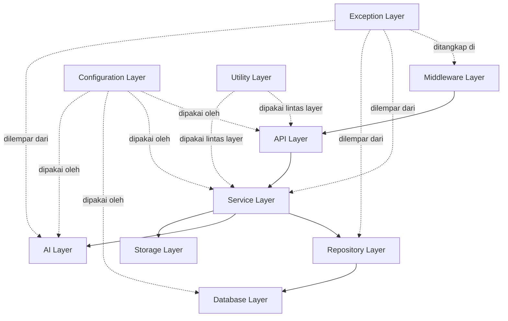
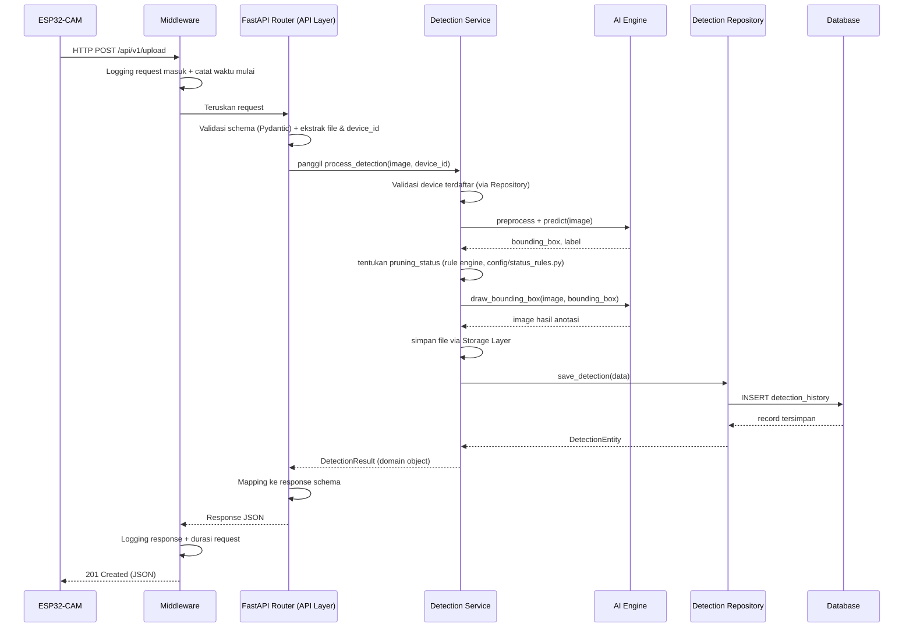

# BACKEND BLUEPRINT & CLEAN ARCHITECTURE
## Sistem Deteksi Tanaman Melon Siap Pangkas

Acuan: 01_SRS.md, 02_Architecture.md, 03_Database.md, 04_API.md, 05_UI_UX.md. Tidak ada requirement yang diubah. Dokumen ini adalah blueprint — belum berisi source code Python.

---

# 1. FILOSOFI ARSITEKTUR BACKEND

### 1.1 Prinsip Utama
Backend ini menangani dua sifat beban kerja yang sangat berbeda dalam satu aplikasi: **I/O ringan berfrekuensi tinggi** (request CRUD dari dashboard) dan **komputasi berat berkala** (inferensi AI per gambar masuk). Filosofi arsitektur disusun untuk menjaga keduanya tidak saling mengganggu, sekaligus tetap berjalan baik pada VPS terbatas (1 vCPU/4GB RAM).

| Prinsip | Penerapan |
|---|---|
| **Separation of Concerns** | Setiap layer hanya mengetahui layer di bawahnya melalui interface/abstraksi, tidak mengetahui detail implementasi layer lain |
| **Dependency Rule (Clean Architecture)** | Dependensi selalu mengarah ke dalam: API → Service → Repository → Database. Service Layer tidak pernah mengetahui detail SQLAlchemy atau FastAPI |
| **Testability first** | Service Layer dapat diuji tanpa database nyata (via mock Repository) dan tanpa HTTP server nyata (via mock Service di level Router) |
| **Pluggable AI** | AI Layer diakses Service melalui interface tetap, sehingga model TFLite dapat diganti/di-upgrade tanpa menyentuh Service maupun Repository |
| **Resource-aware design** | Inferensi berjalan in-process (bukan microservice terpisah) untuk menghindari overhead jaringan/serialisasi tambahan pada VPS 1 vCPU, namun tetap diisolasi secara modular agar dapat dipisah ke service terpisah di masa depan jika resource bertambah |

### 1.2 Filosofi Penamaan & Struktur
Struktur folder dan layer dirancang agar **predictable**: developer baru (atau Claude di sesi berikutnya) dapat menebak di mana suatu logic berada hanya dari namanya, tanpa perlu membaca seluruh codebase.

---

# 2. CLEAN ARCHITECTURE



| Layer | Tanggung Jawab |
|---|---|
| **API Layer** | Menerima HTTP request, validasi schema request/response (Pydantic), routing ke Service yang sesuai. Tidak mengandung business logic — hanya orkestrasi tipis antara HTTP dan Service. |
| **Service Layer** | Tempat seluruh business logic berada: aturan status pangkas, validasi domain, orkestrasi antara AI Layer, Storage Layer, dan Repository. Tidak mengetahui detail HTTP (status code, request object) maupun detail SQL. |
| **Repository Layer** | Abstraksi akses data — satu-satunya layer yang berbicara langsung dengan SQLAlchemy Session/Query. Service memanggil method seperti "simpan deteksi", bukan menyusun query sendiri. |
| **Database Layer** | Definisi model SQLAlchemy (ORM), konfigurasi engine, session factory, dan migration (Alembic). Murni representasi struktur data, tanpa logic bisnis. |
| **AI Layer** | Mengelola seluruh proses terkait model AI: load model, preprocessing, inferensi, post-processing (bounding box, label mapping). Diakses Service melalui interface tetap. |
| **Storage Layer** | Mengelola penyimpanan file fisik (gambar asli, gambar hasil anotasi, file export laporan) — abstraksi agar nantinya dapat berpindah dari local disk ke cloud storage tanpa mengubah Service. |
| **Configuration Layer** | Membaca dan memvalidasi environment variable (`.env`), menyediakan objek settings tunggal yang dipakai layer lain — tidak bergantung pada layer manapun (paling independen). |
| **Utility Layer** | Fungsi lintas-layer yang tidak spesifik domain: logger, formatter response, helper waktu/file. Tidak boleh mengandung business logic maupun bergantung pada Service/Repository. |
| **Exception Layer** | Definisi custom exception class (mis. `ModelLoadError`, `DeviceNotFoundError`, `InvalidFileError`) yang dilempar dari Service/Repository/AI, ditangkap secara terpusat oleh Middleware untuk diubah menjadi response error standar. |
| **Middleware Layer** | Lapisan yang membungkus seluruh request: logging, pengukuran waktu request, CORS, dan penangkapan exception global sebelum response dikirim ke klien. |

---

# 3. STRUKTUR FOLDER

```
backend/
│
├── app/
│   ├── main.py                      # Entry point FastAPI, registrasi router & middleware
│   │
│   ├── api/                         # API LAYER
│   │   └── v1/
│   │       ├── auth.py              # Router: /login, /logout, /me
│   │       ├── detection.py         # Router: /upload, /predict, /latest
│   │       ├── history.py           # Router: /history, /history/{id}
│   │       ├── monitoring.py        # Router: /status
│   │       ├── statistics.py        # Router: /statistics
│   │       └── download.py          # Router: /download/{format}
│   │
│   ├── core/                        # Komponen inti lintas aplikasi
│   │   ├── security.py              # Hashing password, JWT token handling
│   │   └── dependencies.py          # FastAPI Depends() bersama (get_current_user, get_db_session)
│   │
│   ├── config/                      # CONFIGURATION LAYER
│   │   ├── settings.py              # Pydantic Settings, membaca .env
│   │   └── status_rules.py          # Aturan status pangkas (configurable, sesuai SRS)
│   │
│   ├── db/                          # DATABASE LAYER (koneksi & session)
│   │   ├── session.py               # Engine & SessionLocal factory
│   │   └── base.py                  # Base declarative class SQLAlchemy
│   │
│   ├── models/                      # SQLAlchemy ORM models (sesuai 03_Database.md)
│   │   ├── user.py
│   │   ├── device.py
│   │   ├── ai_model.py
│   │   ├── detection_history.py
│   │   ├── activity_log.py
│   │   ├── system_status.py
│   │   ├── statistics_cache.py
│   │   └── system_configuration.py
│   │
│   ├── schemas/                     # Pydantic v2 schemas (request/response, sesuai 04_API.md)
│   │   ├── auth_schema.py
│   │   ├── detection_schema.py
│   │   ├── history_schema.py
│   │   ├── monitoring_schema.py
│   │   ├── statistics_schema.py
│   │   └── common_schema.py         # Struktur response standar success/error
│   │
│   ├── repositories/                # REPOSITORY LAYER
│   │   ├── user_repository.py
│   │   ├── device_repository.py
│   │   ├── detection_repository.py
│   │   ├── activity_log_repository.py
│   │   ├── system_status_repository.py
│   │   └── statistics_repository.py
│   │
│   ├── services/                    # SERVICE LAYER
│   │   ├── auth_service.py
│   │   ├── detection_service.py
│   │   ├── history_service.py
│   │   ├── statistics_service.py
│   │   ├── monitoring_service.py
│   │   └── report_service.py
│   │
│   ├── ai/                          # AI LAYER (terpisah, sesuai 02_Architecture.md)
│   │   ├── model_loader.py
│   │   ├── predictor.py
│   │   ├── image_processor.py
│   │   ├── bounding_box_drawer.py
│   │   └── label_mapper.py
│   │
│   ├── storage/                     # STORAGE LAYER
│   │   ├── image_storage.py         # Simpan/baca gambar (local disk, abstraksi untuk cloud nanti)
│   │   └── report_storage.py        # Generate & simpan file export laporan
│   │
│   ├── middleware/                  # MIDDLEWARE LAYER
│   │   ├── logging_middleware.py
│   │   ├── request_time_middleware.py
│   │   └── cors_middleware.py
│   │
│   ├── exceptions/                  # EXCEPTION LAYER
│   │   ├── custom_exceptions.py     # Definisi exception class domain
│   │   └── exception_handlers.py    # Handler global, dipasang di main.py
│   │
│   └── utils/                       # UTILITY LAYER
│       ├── logger.py
│       ├── response_formatter.py
│       ├── datetime_helper.py
│       └── file_helper.py
│
├── tests/                           # TESTING
│   ├── unit/                        # Unit test per Service/Repository (mocked)
│   ├── integration/                 # Integration test (Service + DB nyata/test DB)
│   └── api/                         # API test (end-to-end via TestClient FastAPI)
│
├── logs/                            # Output log fisik (application, detection, error, access)
│
├── uploads/                         # STORAGE fisik
│   ├── images/                      # Gambar hasil anotasi (tersimpan permanen)
│   ├── temp/                        # File sementara saat proses upload/inferensi
│   └── reports/                     # File hasil export (TXT, nanti PDF/Excel)
│
├── alembic/                         # Migration scripts (lihat 03_Database.md)
│   └── versions/
│
├── ai-model/                        # Model AI fisik (terpisah dari kode aplikasi, sesuai 02_Architecture.md)
│   └── mobilenetv2_fomo.lite
│
├── .env                             # Environment variable (tidak di-commit)
├── .env.example                     # Template environment variable
├── alembic.ini
└── requirements.txt
```

### Fungsi Folder Utama (ringkas)
| Folder | Fungsi |
|---|---|
| `api/` | Titik masuk HTTP, tipis, hanya orkestrasi |
| `core/` | Utilitas inti yang dipakai lintas API (security, dependency injection) |
| `config/` | Sumber kebenaran tunggal untuk seluruh nilai konfigurasi |
| `db/` | Infrastruktur koneksi database, terpisah dari definisi model |
| `models/` | Representasi tabel database sebagai class Python |
| `schemas/` | Kontrak data masuk/keluar API, terpisah dari `models/` agar perubahan API tidak otomatis mengubah struktur database dan sebaliknya |
| `repositories/` | Satu-satunya tempat query database ditulis |
| `services/` | Otak bisnis logic aplikasi |
| `ai/` | Seluruh hal terkait model AI, terisolasi agar mudah diganti |
| `storage/` | Abstraksi baca/tulis file fisik |
| `middleware/` & `exceptions/` | Lapisan lintas-request untuk observability dan error handling konsisten |
| `utils/` | Helper generik tanpa business logic |
| `tests/` | Mengikuti struktur layer yang sama agar mudah dipetakan test-ke-kode |

---

# 4. REQUEST FLOW



**Catatan alur:** Router tidak pernah memanggil Repository atau AI Layer secara langsung — seluruh orkestrasi wajib melalui Service. Ini menjaga Router tetap tipis dan Service tetap dapat diuji tanpa HTTP layer.

---

# 5. AI ENGINE

AI Engine dipecah menjadi 5 modul dengan tanggung jawab tunggal masing-masing (Single Responsibility Principle), agar setiap bagian dapat diuji dan diganti secara independen.

| Modul | Tanggung Jawab |
|---|---|
| **Model Loader** | Memuat file `.lite` ke memori sekali saat aplikasi start (bukan setiap request, demi efisiensi pada VPS terbatas), menyediakan instance model siap pakai ke modul lain, serta menangani kegagalan load model sebagai exception domain (`ModelLoadError`) |
| **Image Processor** | Preprocessing gambar mentah sebelum masuk model: resize, normalisasi, konversi color space (BGR↔RGB) sesuai kebutuhan TFLite — juga menangani validasi bahwa file benar-benar gambar valid (bukan hanya cek ekstensi) |
| **Predictor** | Menjalankan inferensi terhadap tensor yang sudah diproses, mengembalikan output mentah model (koordinat bounding box, index label, confidence internal) — tidak mengetahui apapun tentang database atau HTTP |
| **Label Mapper** | Menerjemahkan index/output mentah model menjadi label domain yang bermakna (`tunas_air`, `buah_siap`, dst.) sesuai definisi label pada SRS — memisahkan "bahasa model" dari "bahasa domain", sehingga jika urutan/jumlah class model berubah di training berikutnya, hanya modul ini yang perlu disesuaikan |
| **Bounding Box Drawer** | Menggambar kotak deteksi & label ke atas citra asli menggunakan OpenCV, menghasilkan gambar final yang akan disimpan — terpisah dari Predictor agar logic visualisasi tidak mencampuri logic inferensi |

**Interface tetap ke Service:** Service hanya memanggil satu titik masuk (mis. fungsi tingkat tinggi `run_inference(image)`) yang secara internal mengorkestrasi kelima modul ini — Service tidak perlu tahu urutan internal AI Engine.

---

# 6. STORAGE STRATEGY

| Jenis File | Disimpan? | Lokasi | Retensi |
|---|---|---|---|
| **Original Image** | Opsional (default: tidak disimpan permanen) | `uploads/temp/` selama proses inferensi berlangsung, dihapus otomatis setelah anotasi berhasil dibuat | Sangat singkat (detik) — menghindari duplikasi penyimpanan karena yang bernilai bagi penelitian adalah gambar hasil anotasi, bukan gambar mentah |
| **Image dengan Bounding Box** | Ya, permanen | `uploads/images/{YYYY}/{MM}/{DD}/{uuid}.jpg` | Permanen, mengikuti retensi `detection_history` (soft delete sesuai 04_API.md) |
| **Log** | Ya | `logs/` (lihat Bagian 11) | Sesuai kebijakan rotasi log |
| **Temporary File** | Ya, sementara | `uploads/temp/` | Dibersihkan otomatis via scheduled cleanup (file lebih tua dari mis. 1 jam dihapus, mengantisipasi proses yang gagal/crash sebelum sempat membersihkan file sendiri) |
| **Report Export** | Ya, sementara/permanen opsional | `uploads/reports/{username_or_request_id}/{timestamp}.txt` | Dapat dibersihkan berkala (mis. file lebih tua dari 7 hari), karena report dapat di-generate ulang kapan saja dari data `detection_history` |

**Struktur folder penyimpanan gambar dipecah per tanggal (`YYYY/MM/DD`)** agar satu folder tidak menampung puluhan ribu file dalam jangka panjang — menjaga performa filesystem dan memudahkan strategi backup incremental per-folder tanggal.

**Abstraksi Storage Layer:** seluruh modul lain mengakses file melalui interface `image_storage.py`/`report_storage.py`, bukan langsung memanggil `open()`/path mentah — ini yang memungkinkan migrasi ke cloud storage (S3-compatible) di masa depan hanya dengan mengganti implementasi di balik interface yang sama (selaras 03_Database.md Bagian 11).

---

# 7. REPOSITORY PATTERN

### 7.1 Alasan Penggunaan

1. **Memisahkan "apa yang dibutuhkan" dari "bagaimana cara mengambilnya"** — Service Layer berbicara dalam bahasa domain (`get_detection_by_id`, `save_detection`), bukan dalam bahasa SQL/ORM (`session.query(...).filter(...)`).
2. **Mendukung kompatibilitas PostgreSQL/MySQL** — Jika suatu saat ada query yang perlu perlakuan berbeda antar database, perbedaan itu cukup ditangani di dalam Repository, tanpa menyebar ke seluruh Service.
3. **Testability** — Service dapat diuji dengan Repository palsu (mock/fake) yang mengembalikan data dummy, tanpa perlu database nyata menyala saat unit testing.
4. **Single source of truth untuk query** — Jika suatu query perlu dioptimasi (mis. menambah `JOIN` atau index baru), perubahan cukup dilakukan di satu tempat (Repository), tidak perlu mencari di seluruh Service mana saja yang menulis query serupa.

### 7.2 Alur Contoh: Menyimpan Hasil Deteksi

```
Router (terima request /upload)
   ↓ memanggil
Service (DetectionService.process_detection)
   ↓ setelah AI Engine selesai, memanggil
Repository (DetectionRepository.save)
   ↓ menggunakan SQLAlchemy Session
Database (INSERT ke tabel detection_history)
```

Service **tidak pernah** mengimpor `sqlalchemy` secara langsung — seluruh interaksi database lewat method Repository yang sudah didefinisikan kontraknya (mis. `save()`, `get_by_id()`, `list_with_filter()`, `soft_delete()`).

---

# 8. SERVICE LAYER

| Service | Tanggung Jawab |
|---|---|
| **Auth Service** | Verifikasi kredensial, generate & validasi token, manajemen sesi logout (token blacklist/invalidation), pengambilan data user aktif (`/me`) |
| **Detection Service** | Orkestrasi inti: menerima gambar (dari `/upload` maupun `/predict`), memanggil AI Engine, menentukan `pruning_status` via rule engine (`config/status_rules.py`), menyimpan hasil melalui Storage & Repository — satu-satunya pintu masuk logic deteksi, dipakai bersama oleh dua endpoint (`/upload` dan `/predict`) untuk menghindari duplikasi logic |
| **History Service** | Mengelola query riwayat dengan pagination/filter/search/sort, mengambil detail satu record, serta menjalankan soft delete beserta pencatatan ke Activity Log |
| **Statistics Service** | Membaca dari `statistics_cache`, melakukan agregasi tambahan ringan jika diperlukan (mis. label distribution), dan bertanggung jawab memicu pembaruan cache setelah ada deteksi baru |
| **Monitoring Service** | Mengumpulkan status terkini dari berbagai sumber (status koneksi DB, status model AI yang sudah dimuat, status resource VPS via `psutil` atau setara, status ESP32 berdasar `last_seen` pada tabel `devices`), menyimpan snapshot ke `system_status` |
| **Report Service** | Mengambil data terfilter dari History Service/Repository, memformat menjadi file (TXT saat ini), menyimpan via Storage Layer, dan menyediakan path file untuk diunduh — dirancang generik agar penambahan format PDF/Excel hanya menambah strategi formatting baru tanpa mengubah alur pengambilan data |

---

# 9. DATABASE SESSION

- **Engine** dibuat satu kali saat aplikasi start (`db/session.py`), menggunakan connection string dari Configuration Layer — mendukung baik PostgreSQL maupun MySQL hanya dengan mengganti nilai `.env`.
- **Session per-request**: setiap request HTTP memperoleh satu instance `Session` baru melalui dependency injection FastAPI (`Depends(get_db_session)`), yang otomatis ditutup setelah request selesai (baik sukses maupun gagal) — mencegah session bocor/menggantung.
- **Transaction boundary** berada di level Service: Service yang memutuskan kapan melakukan `commit()` (umumnya setelah seluruh langkah dalam satu use case berhasil) dan kapan `rollback()` (jika terjadi exception di tengah proses, mis. AI Engine gagal setelah file sempat tersimpan).
- **Pooling**: menggunakan connection pool bawaan SQLAlchemy dengan ukuran pool yang disesuaikan kapasitas VPS (pool kecil, mis. 5 koneksi, agar tidak membebani PostgreSQL/MySQL pada server 4GB RAM yang sama-sama berbagi resource dengan proses inferensi AI).
- **Konsistensi lintas database**: seluruh query ditulis menggunakan SQLAlchemy Core/ORM murni tanpa raw SQL spesifik vendor, sehingga perilaku identik di PostgreSQL maupun MySQL (selaras 03_Database.md).

---

# 10. CONFIGURATION

Seluruh konfigurasi sensitif dan environment-specific disimpan di `.env`, dibaca melalui Pydantic Settings (`config/settings.py`) — tidak ada nilai konfigurasi yang di-hardcode dalam kode.

| Variabel | Keterangan |
|---|---|
| `APP_ENV` | `development` / `staging` / `production` |
| `APP_HOST`, `APP_PORT` | Host & port FastAPI |
| `SECRET_KEY` | Kunci rahasia untuk signing JWT |
| `ACCESS_TOKEN_EXPIRE_MINUTES` | Masa berlaku token |
| `DATABASE_URL` | Connection string (format berbeda untuk PostgreSQL/MySQL, namun nama variabel sama) |
| `DB_POOL_SIZE` | Ukuran connection pool |
| `AI_MODEL_PATH` | Path file `.lite` aktif (selaras `ai_models.model_path`) |
| `AI_INPUT_SIZE` | Dimensi input yang diharapkan model |
| `UPLOAD_MAX_SIZE_MB` | Batas ukuran upload (default 5 MB, sesuai 04_API.md) |
| `ALLOWED_IMAGE_EXTENSIONS` | `jpg,jpeg,png` |
| `IMAGE_STORAGE_PATH` | Path root penyimpanan gambar |
| `REPORT_STORAGE_PATH` | Path root penyimpanan file export |
| `CORS_ALLOWED_ORIGINS` | Domain frontend yang diizinkan |
| `LOG_LEVEL` | `INFO` / `DEBUG` / `WARNING` / `ERROR` |
| `TEMP_FILE_CLEANUP_INTERVAL_MINUTES` | Interval pembersihan `uploads/temp/` |

---

# 11. LOGGING

| Jenis Log | Isi | Lokasi File |
|---|---|---|
| **Application Log** | Lifecycle aplikasi: startup, shutdown, model berhasil dimuat, koneksi DB berhasil/gagal | `logs/application.log` |
| **Detection Log** | Setiap proses inferensi: device_id, label hasil, durasi inferensi, sukses/gagal — terpisah dari application log agar mudah dianalisis untuk keperluan penelitian/skripsi (mis. menghitung rata-rata durasi inferensi) | `logs/detection.log` |
| **Error Log** | Seluruh exception yang ditangkap Exception Layer, termasuk stack trace, untuk debugging | `logs/error.log` |
| **Access Log** | Setiap HTTP request masuk: method, path, status code, durasi (dari Request Time Middleware) — untuk audit trafik dan deteksi anomali penggunaan API | `logs/access.log` |

**Strategi rotasi:** log dirotasi harian (mis. `detection-2026-06-30.log`) dengan retensi terbatas (mis. 30 hari) agar tidak membebani storage VPS yang hanya 50GB NVMe.

---

# 12. EXCEPTION HANDLING

Penanganan error dilakukan **terpusat** melalui Exception Layer + Middleware, bukan tersebar sebagai `try-except` ad-hoc di setiap Router.

| Exception Domain | Dipicu Saat | Status Code | Ditangani Sebagai |
|---|---|---|---|
| `InvalidFileError` | File bukan gambar valid / ekstensi tidak didukung | 400 | Pesan jelas + `error.code: INVALID_FILE_FORMAT` |
| `FileTooLargeError` | Ukuran file melebihi `UPLOAD_MAX_SIZE_MB` | 413 | `error.code: FILE_TOO_LARGE` |
| `ModelLoadError` | Model `.lite` gagal dimuat saat startup atau korup | 500 | Dicatat ke Error Log dengan prioritas tinggi, response generik ke klien (tidak membocorkan detail internal) |
| `DatabaseConnectionError` | Koneksi DB terputus saat request berlangsung | 500 | Response generik "Layanan sedang bermasalah", dicatat ke Error Log, dapat memicu update `system_status.database_status` |
| `DeviceNotFoundError` | `device_id` tidak terdaftar saat `/upload` | 404 | `error.code: DEVICE_NOT_FOUND` |
| `DeviceOfflineWarning` | Device dikenali "offline" berdasar `last_seen` namun tetap mengirim data (anomali) | — (bukan error fatal) | Dicatat sebagai Activity Log, tidak menghentikan proses penyimpanan deteksi |
| `AuthenticationError` | Kredensial salah, token invalid/expired | 401 | `error.code: INVALID_CREDENTIALS` / `TOKEN_EXPIRED` |
| `AuthorizationError` | Role tidak memiliki izin (mis. user mencoba akses endpoint admin) | 403 | `error.code: FORBIDDEN` |
| `ValidationError` (dari Pydantic) | Schema request tidak sesuai | 422 | Ditangani otomatis oleh FastAPI, diformat ulang agar konsisten dengan struktur response standar (04_API.md) |

Seluruh custom exception didefinisikan di `exceptions/custom_exceptions.py`, ditangkap oleh handler global di `exceptions/exception_handlers.py` yang didaftarkan ke FastAPI app (`app.add_exception_handler`) — memastikan **setiap** error, dari layer manapun ia dilempar, selalu keluar dalam format response standar (`success: false, message, error`) sesuai 04_API.md.

---

# 13. MIDDLEWARE

| Middleware | Fungsi | Urutan Eksekusi |
|---|---|---|
| **CORS Middleware** | Mengizinkan request dari domain Frontend NextJS yang terdaftar (`CORS_ALLOWED_ORIGINS`) | Paling luar (pertama memproses request masuk) |
| **Request Time Middleware** | Mencatat waktu mulai & selesai request, menambahkan header `X-Process-Time` pada response, dan menjadi sumber data untuk Access Log | Setelah CORS |
| **Logging Middleware** | Mencatat setiap request masuk & response keluar ke Access Log (method, path, status code, durasi dari Request Time Middleware) | Setelah Request Time |
| **Error Handler (Exception Middleware)** | Lapisan terakhir yang menangkap exception tak tertangani dari layer manapun di dalamnya, memastikan klien tetap menerima response JSON terstruktur, bukan stack trace mentah | Membungkus seluruh proses request (innermost layer sebelum mencapai Router) |

---

# 14. TESTING STRATEGY

| Jenis Test | Cakupan | Tools | Karakteristik |
|---|---|---|---|
| **Unit Test** | Service Layer & AI Layer secara terisolasi — mis. memastikan rule engine status pangkas menghasilkan output benar untuk setiap kombinasi label, atau Label Mapper menerjemahkan index dengan tepat | `pytest`, mocking Repository & AI model | Cepat, tidak menyentuh database/file nyata, dijalankan setiap commit |
| **Integration Test** | Interaksi Service ↔ Repository ↔ Database nyata (menggunakan database test terpisah, bukan production) — mis. memastikan `save_detection` benar-benar tersimpan dan dapat di-query kembali | `pytest` + database test (SQLite in-memory atau PostgreSQL test container) | Menguji query nyata, termasuk constraint Foreign Key dan index |
| **API Test** | End-to-end melalui FastAPI `TestClient`, mensimulasikan request HTTP penuh (termasuk upload file dummy) ke seluruh endpoint pada 04_API.md, memverifikasi status code dan struktur response standar | `pytest` + `httpx`/`TestClient` | Paling mendekati perilaku nyata, dijalankan sebelum deployment |

**Prioritas testing mengingat konteks skripsi:** Unit Test pada rule engine status pangkas dan Label Mapper diprioritaskan tinggi karena logic ini langsung memengaruhi validitas hasil penelitian, sementara Integration/API Test memastikan keseluruhan pipeline (sesuai Request Flow Bagian 4) bekerja sebagaimana didesain.

---

# 15. FUTURE SCALABILITY

| Kebutuhan Masa Depan | Bagaimana Blueprint Saat Ini Mendukung |
|---|---|
| **Multi Device** | Sudah menjadi bagian inti desain (`device_id` di seluruh alur Detection Service & Repository) — tidak memerlukan perubahan layer manapun. |
| **Multi Model AI** | AI Layer sudah terisolasi sebagai modul tersendiri dengan interface tetap; penambahan model baru cukup menambah implementasi `Model Loader`/`Predictor` baru dan mengatur `ai_models.is_active`, tanpa mengubah Service Layer. |
| **Docker** | Struktur folder `backend/` yang sudah modular dan bergantung penuh pada `.env` untuk konfigurasi membuatnya siap di-containerize — `Dockerfile` cukup menyalin struktur ini dan menjalankan `app/main.py`, tanpa restrukturisasi kode. |
| **Redis Cache** | `statistics_cache` saat ini berbentuk tabel database; jika beban baca meningkat, Statistics Service dapat ditambah lapisan cache Redis di depan Repository tanpa mengubah kontrak Service ke Router. |
| **Celery Background Task** | Proses seperti pembersihan `uploads/temp/`, pembaruan `statistics_cache`, atau generate report besar saat ini dapat dijalankan synchronous/scheduled sederhana; arsitektur Service Layer yang sudah terpisah dari Router memudahkan logic yang sama dipanggil ulang sebagai Celery task tanpa duplikasi logic. |
| **WebSocket (opsional)** | Jika di masa depan dibutuhkan push realtime (menggantikan polling pada Live Detection), Detection Service tetap menjadi sumber data tunggal — hanya perlu menambah broadcaster di API Layer setelah `save_detection` berhasil, tanpa mengubah Service maupun Repository. |

---

*Dokumen ini merupakan hasil Tahap Backend Blueprint & Clean Architecture. Belum ada source code Python yang dibuat, sesuai instruksi.*
