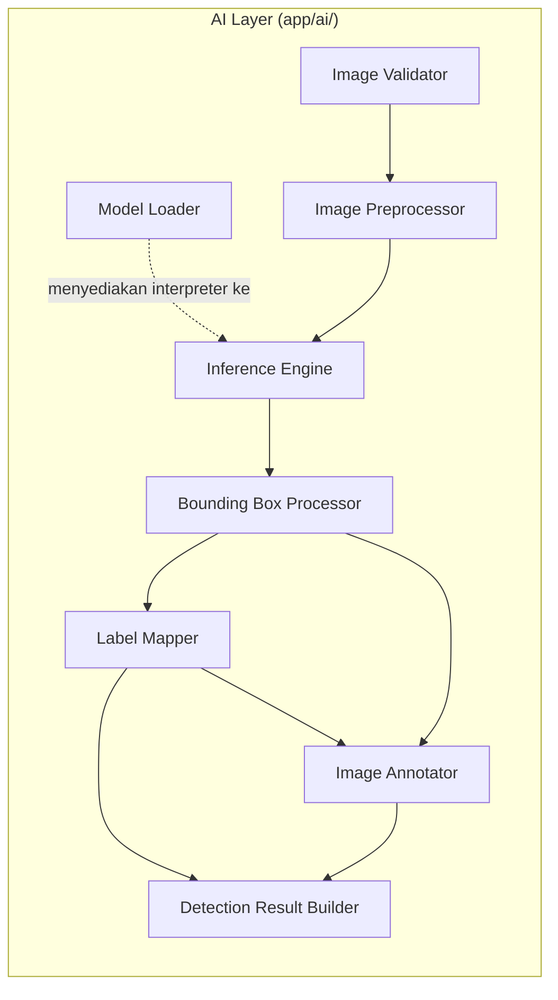
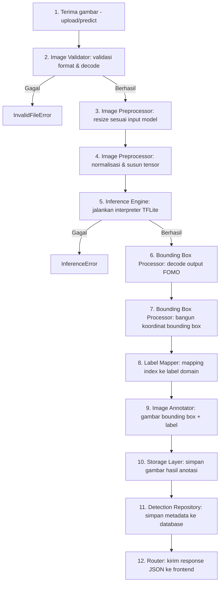
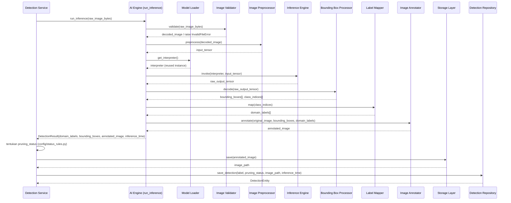

# AI INTEGRATION BLUEPRINT
## Sistem Deteksi Tanaman Melon Siap Pangkas (ESP32-CAM + AI)

Acuan: 01_SRS.md, 02_Architecture.md, 03_Database.md, 04_API.md, 05_UI_UX.md, 06_Backend_Blueprint.md, 07_Frontend_Architecture.md. Tidak ada requirement yang diubah. Dokumen ini adalah blueprint integrasi AI ke FastAPI — **belum berisi source code**.

---

# 1. FILOSOFI INTEGRASI AI

### 1.1 Posisi AI Layer dalam Sistem

AI Engine bukan microservice eksternal — sesuai 02_Architecture.md, ia berjalan **in-process** di dalam proses FastAPI yang sama, dipanggil secara sinkron oleh Detection Service. Keputusan ini bukan kompromi, melainkan konsekuensi langsung dari batasan VPS (1 vCPU/4GB RAM): memisahkan inferensi ke proses/container lain akan menambah overhead serialisasi gambar via jaringan, yang justru lebih mahal daripada keuntungan isolasinya pada skala ini.

### 1.2 Prinsip Desain

| Prinsip | Penerapan dalam AI Layer |
|---|---|
| **Single Responsibility per modul** | Setiap tahap pipeline (load, validasi, preprocessing, inferensi, decode, mapping, anotasi) adalah modul terpisah, masing-masing dapat diuji dan diganti sendiri-sendiri |
| **Interface tetap ke Service** | Detection Service hanya mengenal satu titik masuk tingkat tinggi (`run_inference`); detail orkestrasi internal AI Engine tersembunyi dari Service |
| **Model-agnostic boundary** | Modul di luar `Predictor` dan `Model Loader` tidak boleh mengetahui detail TensorFlow Lite — jika suatu hari model berganti format (mis. ONNX), hanya dua modul ini yang berubah |
| **Stateless per-request, stateful di level proses** | Interpreter model dimuat sekali dan reusable, tetapi setiap request inferensi diproses sebagai unit independen — tidak ada state yang bocor antar-request |
| **Fail predictable, bukan fail silent** | Setiap kegagalan pada tiap tahap pipeline harus menghasilkan exception domain yang jelas (selaras 06_Backend_Blueprint.md Bagian 12), bukan nilai default yang menyamarkan kegagalan |
| **Confidence internal, tidak pernah keluar batas AI Layer** | Sesuai SRS 1.3, confidence score boleh dipakai *secara internal* di dalam AI Layer (mis. untuk debugging/logging teknis non-produksi), tetapi **tidak pernah** diteruskan ke Service, Database, maupun response API |

### 1.3 Mengapa Dipecah Menjadi 8 Modul (bukan 5 seperti di Backend Blueprint)

06_Backend_Blueprint.md Bagian 5 menyebut 5 modul AI Engine (Model Loader, Image Processor, Predictor, Label Mapper, Bounding Box Drawer) sebagai ringkasan arsitektural. Dokumen ini memecahnya lebih granular menjadi 8 modul untuk kebutuhan blueprint implementasi, tanpa mengubah struktur folder `app/ai/` yang sudah ditetapkan — pemecahan ini murni pembagian tanggung jawab di dalam file-file yang sudah ada (mis. `image_processor.py` membungkus baik Image Validator maupun Image Preprocessor; `predictor.py` membungkus baik Inference Engine maupun Bounding Box Processor). Detail pemetaan modul-ke-file dijelaskan di Bagian 2.

---

# 2. ARSITEKTUR AI



### 2.1 Tanggung Jawab Tiap Modul

| Modul | File (selaras struktur 06_Backend_Blueprint.md) | Tanggung Jawab |
|---|---|---|
| **Model Loader** | `ai/model_loader.py` | Memuat file `.lite` ke memori sekali saat startup aplikasi; menyimpan instance interpreter sebagai singleton tingkat-aplikasi; menyediakan method reload tanpa restart server; melempar `ModelLoadError` jika gagal |
| **Image Validator** | bagian dari `ai/image_processor.py` | Memastikan byte yang diterima benar-benar dapat di-decode sebagai gambar (bukan sekadar cek ekstensi file); menolak file korup sebelum masuk tahap resize — mencegah crash di tahap preprocessing |
| **Image Preprocessor** | bagian dari `ai/image_processor.py` | Resize ke dimensi input model (`AI_INPUT_SIZE`), konversi color space (BGR↔RGB sesuai kebutuhan TFLite), normalisasi nilai piksel, susun menjadi tensor input siap pakai |
| **Inference Engine** | bagian dari `ai/predictor.py` | Menjalankan `interpreter.invoke()` terhadap tensor input, mengambil output tensor mentah dari interpreter; tidak mengetahui apa pun tentang HTTP, database, atau bounding box final |
| **Bounding Box Processor** | bagian dari `ai/predictor.py` | Mendekode output mentah FOMO (grid heatmap per kelas) menjadi koordinat bounding box + index kelas per deteksi; menerapkan threshold (jika diaktifkan) dan non-max suppression sederhana bila diperlukan |
| **Label Mapper** | `ai/label_mapper.py` | Menerjemahkan index kelas hasil model menjadi label domain (`tunas_air`, `buah_siap`, dst.) sesuai `labels.yaml` (02_Architecture.md Bagian 9); memisahkan "bahasa model" dari "bahasa domain" |
| **Image Annotator** | `ai/bounding_box_drawer.py` | Menggambar kotak + teks label ke atas citra asli menggunakan OpenCV, menghasilkan citra final yang akan disimpan secara permanen |
| **Detection Result Builder** | bagian dari `ai/predictor.py` (objek hasil) atau domain object di Service | Menyusun seluruh output modul sebelumnya menjadi satu objek domain `DetectionResult` (label, pruning_status candidate dari rule engine, image path, inference_time) yang diteruskan dari AI Engine ke Detection Service |

**Catatan penting:** Pembagian modul ini adalah pembagian *logis/tanggung jawab*, bukan pemaksaan satu file per modul. Sesuai struktur folder 06_Backend_Blueprint.md, beberapa modul logis digabung dalam satu file fisik (`image_processor.py`, `predictor.py`) agar jumlah file tetap sesuai blueprint backend yang sudah disepakati — tidak menambah file baru tanpa alasan kuat.

---

# 3. PIPELINE AI



### 3.1 Penjelasan Alur Lintas-Layer

Pipeline di atas murni proses di dalam **AI Layer + Storage + Repository**. Posisinya dalam keseluruhan Request Flow (lihat 06_Backend_Blueprint.md Bagian 4) adalah sebagai berikut:



Service tetap menjadi satu-satunya pihak yang memanggil AI Layer dan Storage Layer secara langsung — AI Engine tidak pernah menulis ke disk atau database sendiri, menjaga prinsip *Separation of Concerns* dari 06_Backend_Blueprint.md tetap utuh.

---

# 4. MODEL LOADER

### 4.1 Strategi Pemuatan

- Model `.lite` dimuat **satu kali** pada *application startup event* FastAPI (`@app.on_event("startup")` atau `lifespan` context), bukan per-request — krusial pada VPS 1 vCPU karena memuat ulang interpreter setiap request akan sangat membebani CPU dan menambah latensi tidak perlu.
- Instance interpreter disimpan sebagai **singleton tingkat-aplikasi** (mis. di `app.state` FastAPI atau modul-level cache di `model_loader.py`), diakses oleh seluruh request inferensi secara *reuse*.
- Path model dibaca dari konfigurasi (`AI_MODEL_PATH`, selaras 06_Backend_Blueprint.md Bagian 10), bukan hardcoded — selaras keputusan `ai-model/` terpisah dari kode aplikasi (02_Architecture.md Bagian 9).

### 4.2 Reuse Interpreter

Satu instance `Interpreter` TensorFlow Lite dipakai berulang untuk seluruh request selama proses backend berjalan. TFLite interpreter pada dasarnya tidak thread-safe untuk invoke paralel pada instance yang sama — karena beban request inferensi di sistem ini bersifat periodik (≈1 gambar/detik dari ESP32) dan bukan concurrent burst tinggi, satu interpreter dengan eksekusi sekuensial (dijaga melalui lock ringan di level `predictor.py`) sudah memadai tanpa perlu connection-pool interpreter.

### 4.3 Hot Reload Tanpa Restart Server

Disediakan method `reload_model(new_path)` pada Model Loader yang:
1. Memuat interpreter baru ke memori secara terpisah dari interpreter aktif.
2. Melakukan validasi minimal (mis. cek input/output tensor shape sesuai ekspektasi) sebelum menggantikan interpreter aktif.
3. Menukar referensi interpreter aktif secara atomik (swap pointer), bukan mematikan interpreter lama lalu memuat yang baru secara berurutan — menghindari jendela waktu di mana tidak ada interpreter siap pakai.
4. Mencatat pergantian model ke Activity Log dan memperbarui `ai_models.is_active` (03_Database.md Bagian 3.3) melalui Service terkait.

Mekanisme ini menjadi dasar pendukung requirement **Future Scalability: Hot Reload Model** tanpa mengubah struktur AI Layer.

### 4.4 Kegagalan Model Loader

Jika model gagal dimuat saat startup, `ModelLoadError` dilempar (selaras 06_Backend_Blueprint.md Bagian 12) dan dicatat dengan prioritas tinggi di Error Log. Sistem tetap dapat start (agar endpoint non-AI seperti `/login`, `/history` tetap dapat diakses untuk debugging), namun endpoint `/upload` dan `/predict` akan mengembalikan `500` dengan `error.code: MODEL_NOT_LOADED` hingga model berhasil dimuat ulang.

---

# 5. IMAGE PREPROCESSING

| Tahap | Penjelasan |
|---|---|
| **Validasi ukuran & format** | Dilakukan dua lapis: (1) di API Layer sesuai 04_API.md (ekstensi `.jpg/.jpeg/.png`, maksimal 5 MB) sebelum file diteruskan ke AI Layer; (2) di Image Validator — percobaan decode aktual menggunakan OpenCV/Pillow, karena ekstensi file yang valid tidak menjamin isi byte adalah gambar yang valid |
| **Resize** | Gambar diubah ke dimensi input model (`AI_INPUT_SIZE`, dibaca dari konfigurasi, selaras kebutuhan MobileNetV2 FOMO) menggunakan interpolasi standar (mis. bilinear) — rasio aspek tidak perlu dipertahankan secara ketat karena FOMO bekerja pada grid spasial tetap, namun strategi resize (stretch vs letterbox/padding) harus konsisten antara data training dan inferensi produksi |
| **Color Space** | OpenCV membaca gambar dalam BGR secara default, sedangkan kebanyakan model TFLite dilatih dengan asumsi RGB — konversi BGR→RGB wajib dilakukan di tahap ini, sebelum normalisasi |
| **Normalization** | Nilai piksel diskalakan sesuai skema yang dipakai saat training (umumnya `[0,1]` via pembagian 255, atau `[-1,1]` untuk varian MobileNetV2 tertentu) — skema normalisasi harus konsisten dengan pipeline training, didefinisikan sebagai konstanta eksplisit di `image_processor.py`, bukan angka ajaib tersembunyi |
| **Penanganan gambar rusak** | Jika decode gagal (file korup, header rusak, payload bukan gambar sama sekali), Image Validator melempar `InvalidFileError` sebelum tensor dibentuk — proses dihentikan sedini mungkin agar tidak membuang siklus CPU pada tahap resize/inferensi yang pasti gagal |

---

# 6. INFERENCE

### 6.1 Input Tensor

Input tensor disusun mengikuti shape yang diharapkan interpreter (`interpreter.get_input_details()`), biasanya berbentuk `[1, H, W, 3]` (batch size 1, height, width, channel RGB) dengan tipe data sesuai model (`float32` atau `uint8` jika model terkuantisasi). Shape dan dtype divalidasi sekali saat startup (oleh Model Loader) agar Image Preprocessor tahu target pasti tanpa perlu introspeksi ulang setiap request.

### 6.2 Output Tensor

Output FOMO (Faster Objects, More Objects) berbeda dari deteksi objek konvensional (anchor box/bounding box regressor) — outputnya berupa **heatmap grid spasial** di mana setiap sel grid memprediksi probabilitas kelas pada lokasi tersebut. Output tensor diambil melalui `interpreter.get_output_details()` dan dibaca sebagai array probabilitas per-kelas per-sel-grid.

### 6.3 Cara Menjalankan Interpreter

Alur konseptual menjalankan satu inferensi:
1. `interpreter.set_tensor(input_index, input_tensor)`
2. `interpreter.invoke()`
3. `output = interpreter.get_tensor(output_index)`
4. Catat durasi antara langkah 1–3 sebagai `inference_time` (selaras requirement SRS 1.4: pencatatan durasi inferensi sebagai metrik performa)

### 6.4 Penanganan Kegagalan Inferensi

| Skenario Kegagalan | Penanganan |
|---|---|
| Interpreter belum dimuat (`ModelLoadError` sebelumnya belum pulih) | Inference Engine menolak request sebelum mencoba `invoke()`, melempar exception domain `ModelNotReadyError` → response `500` |
| `invoke()` melempar exception internal TFLite (mis. shape mismatch akibat model diganti tanpa validasi) | Ditangkap, dibungkus sebagai `InferenceError`, dicatat ke Detection Log dengan detail teknis, response `500` ke klien tanpa membocorkan stack trace mentah |
| Inferensi berhasil namun output tidak masuk akal (mis. seluruh nilai NaN) | Diperlakukan sebagai kegagalan inferensi (`InferenceError`), bukan diteruskan sebagai hasil "tidak ada objek" — mencegah data cacat masuk ke database penelitian |
| Timeout (inferensi berjalan abnormal lama, indikasi resource VPS bermasalah) | Opsional: batas waktu lunak (soft timeout) di level Service yang memantau durasi sebelum invoke selesai; jika dipakai, kegagalan ini juga memicu pembaruan `system_status.ai_status` menjadi `error` |

---

# 7. POST PROCESSING

| Tahap | Penjelasan |
|---|---|
| **Decode output FOMO** | Output grid diiterasi per sel; setiap sel dengan kelas dominan (probabilitas tertinggi di antara kelas yang ada) menjadi kandidat deteksi. Karena FOMO tidak menghasilkan bounding box berukuran bebas seperti YOLO, satu sel grid yang terdeteksi dipetakan menjadi satu bounding box berukuran tetap (sesuai ukuran reseptif grid pada resolusi input), bukan box dengan lebar/tinggi yang diregresikan model |
| **Threshold (opsional, dapat dinonaktifkan)** | Sesuai instruksi proyek, ambang batas confidence untuk menentukan apakah suatu sel dianggap "terdeteksi" bersifat **configurable** dan dapat **dinonaktifkan sepenuhnya** (mis. melalui `system_configuration` atau env var `AI_DETECTION_THRESHOLD`, dengan nilai `null`/`0` berarti "tampilkan kelas dominan apa pun, walau confidence rendah"). Confidence yang dipakai untuk threshold ini murni internal pada tahap ini — nilainya **tidak pernah diteruskan** ke Label Mapper, Detection Result Builder, Service, maupun Database (selaras SRS 1.3) |
| **Label Mapping** | Index kelas numerik dipetakan ke label domain via `labels.yaml` (lihat Bagian 9) |
| **Penyusunan hasil deteksi** | Hasil akhir post-processing adalah daftar `{bounding_box, domain_label}` per objek terdeteksi (tanpa confidence), siap diteruskan ke Image Annotator dan Detection Result Builder |

### 7.1 Penanganan "Tidak Ada Objek Terdeteksi"

Jika tidak ada sel grid yang memenuhi kriteria deteksi (baik karena threshold aktif tidak terpenuhi, atau memang tidak ada objek pada citra), pipeline **tetap melanjutkan** ke tahap Image Annotator (yang dalam kasus ini hanya menyimpan citra asli tanpa bounding box) dan Detection Result Builder tetap menyusun hasil dengan label eksplisit `tidak_terdeteksi` atau setara — bukan dianggap error. Keputusan apakah baris ini tetap disimpan ke `detection_history` (mis. untuk keperluan audit "ESP32 aktif tapi tidak ada objek") merupakan keputusan business rule di Detection Service, bukan tanggung jawab AI Layer.

---

# 8. BOUNDING BOX

| Aspek | Keputusan |
|---|---|
| **Siapa yang menggambar** | Backend (modul Image Annotator, `ai/bounding_box_drawer.py`), menggunakan OpenCV — selaras 02_Architecture.md & 05_UI_UX.md yang menyatakan gambar yang disimpan dan dikirim ke frontend **sudah teranotasi**; frontend tidak menggambar ulang bounding box di sisi client |
| **Warna per label** | Karena 05_UI_UX.md belum mendefinisikan warna spesifik untuk kelima label deteksi (hanya warna status `siap_pangkas`/`belum_siap_pangkas`), blueprint ini mengusulkan palet warna bounding box yang konsisten dengan design token 05_UI_UX.md Bagian 2.1, agar dapat langsung dipakai ulang sebagai warna badge/pie chart di frontend (lihat tabel di bawah) |
| **Ketebalan garis** | 2px pada resolusi gambar asli (bukan resolusi input model 96×96/160×160) — gambar dianotasi pada resolusi asli ESP32-CAM agar hasil tetap tajam saat dilihat di Dashboard/History, bukan pada resolusi kecil hasil resize untuk model |
| **Penempatan teks label** | Teks label domain (bukan index numerik, bukan confidence) ditempatkan di atas sisi kiri-atas bounding box, dengan latar belakang solid sewarna garis box (agar tetap terbaca di atas citra tanaman yang umumnya hijau) |
| **Penyimpanan** | Hanya citra hasil anotasi yang disimpan permanen ke `uploads/images/{YYYY}/{MM}/{DD}/`; citra asli hanya berada sementara di `uploads/temp/` selama proses berlangsung (selaras 06_Backend_Blueprint.md Bagian 6) |

### 8.1 Usulan Palet Warna Bounding Box per Label

| Label | Warna Usulan | Alasan |
|---|---|---|
| Tunas Air | `#3B82F6` (Info — blue-500) | Bukan bagian dari objek "siap/tidak siap pangkas" utama (buah/daun), sehingga dipisahkan secara visual menggunakan token Info yang netral, bukan hijau/amber yang sudah dipakai untuk makna status |
| Buah Siap Pangkas | `#22C55E` (Success — green-500) | Konsisten dengan makna "siap pangkas" pada token Success di 05_UI_UX.md |
| Buah Tidak Siap Pangkas | `#F59E0B` (Warning — amber-500) | Konsisten dengan makna "belum siap" pada token Warning di 05_UI_UX.md |
| Daun Siap Pangkas | `#15803D` (Primary Dark — green-700) | Varian hijau lebih gelap dari "Buah Siap Pangkas" agar kedua label "siap pangkas" tetap dapat dibedakan sekilas tanpa membaca teks, namun tetap dalam keluarga warna sukses |
| Daun Tidak Siap Pangkas | `#B45309` (amber-700, varian gelap Warning) | Varian amber lebih gelap dari "Buah Tidak Siap Pangkas", dengan logika pembedaan yang sama seperti pasangan daun/buah siap pangkas |

*Catatan:* Palet ini didefinisikan satu kali di `labels.yaml` (Bagian 9) sebagai sumber kebenaran tunggal, lalu dikonsumsi baik oleh Image Annotator (backend) maupun, jika diperlukan, diekspos sebagai bagian dari konfigurasi statis ke Frontend agar warna badge/pie chart (05_UI_UX.md Bagian "Statistik") tetap konsisten dengan warna bounding box pada gambar — sesuai prinsip konsistensi warna lintas halaman yang ditekankan di 05_UI_UX.md.

---

# 9. LABEL MAPPING

### 9.1 Lima Label Domain (sesuai SRS & Database)

```yaml
# ai-model/labels.yaml (konseptual, bukan kode implementasi)
labels:
  0: tunas_air
  1: buah_tidak_siap
  2: buah_siap
  3: daun_tidak_siap
  4: daun_siap
```

### 9.2 Strategi Pemetaan

- Index kelas (0–4, urutan sesuai output layer model saat training) dipetakan ke string enum domain yang **identik** dengan enum `label` pada tabel `detection_history` (03_Database.md Bagian 3.4) — mencegah mismatch antara apa yang disimpan AI dan apa yang divalidasi skema database.
- Mapping disimpan sebagai file konfigurasi terpisah (`labels.yaml`), bukan hardcoded di kode Python, agar jika model dilatih ulang dengan urutan kelas berbeda, perbaikan cukup dilakukan dengan mengubah file ini — Label Mapper tetap membaca dari konfigurasi yang sama tanpa perubahan logic.
- Label tampilan ke pengguna (mis. "Buah Siap Pangkas" dengan kapitalisasi dan spasi) adalah tanggung jawab **Frontend** (07_Frontend_Architecture.md), yang menerjemahkan enum snake_case dari API menjadi teks tampilan — AI Layer dan Database hanya berurusan dengan bentuk `snake_case` mentah.
- Jika model di masa depan menghasilkan kelas yang tidak dikenali (index di luar range yang didefinisikan di `labels.yaml`), Label Mapper melempar `UnknownLabelError`, dicatat ke Error Log — bukan secara diam-diam memetakan ke label sembarang yang dapat mencemari data penelitian.

---

# 10. STORAGE

### 10.1 Struktur Direktori (selaras 06_Backend_Blueprint.md Bagian 6)

```
uploads/
├── images/                  # Gambar hasil anotasi — permanen
│   └── {YYYY}/{MM}/{DD}/
│       └── {uuid}.jpg
├── temp/                    # Gambar mentah selama proses inferensi berlangsung
│   └── {uuid}_raw.jpg
└── reports/                 # Output ekspor laporan (di luar cakupan AI Layer)
```

### 10.2 Strategi Penamaan File

- Nama file menggunakan **UUID v4**, bukan nama asli/timestamp mentah dari ESP32 — menghindari tabrakan nama saat multi-device mengirim gambar secara bersamaan (mendukung requirement Future Scalability: Multi Device sejak awal, selaras 03_Database.md Bagian 14).
- UUID yang dipakai sebagai nama file **adalah UUID yang sama** dengan `detection_history.id` (bukan UUID acak terpisah) — sehingga path gambar dapat direkonstruksi langsung dari ID record database tanpa perlu kolom mapping tambahan, sekaligus memudahkan korelasi log/debugging.
- Struktur folder per-tanggal (`{YYYY}/{MM}/{DD}`) mengikuti `detection_time`, bukan `created_at`, agar konsisten dengan makna "kapan gambar ini diambil" secara penelitian, bukan "kapan baris database dibuat" (umumnya identik, namun secara desain dipisahkan agar jelas).

### 10.3 Siklus Hidup File Sementara

Gambar mentah di `uploads/temp/` dihapus segera setelah Image Annotator berhasil menghasilkan citra final — bukan dipertahankan. Sebagai pengaman tambahan (jika proses gagal di tengah jalan sebelum sempat membersihkan file sendiri), scheduled cleanup menghapus file di `temp/` yang lebih tua dari ambang waktu tertentu (mis. 1 jam), selaras `TEMP_FILE_CLEANUP_INTERVAL_MINUTES` (06_Backend_Blueprint.md Bagian 10).

---

# 11. ERROR HANDLING

| Skenario | Modul Pendeteksi | Exception Domain | HTTP Status | Catatan |
|---|---|---|---|---|
| Model belum dimuat / gagal dimuat saat startup | Model Loader | `ModelLoadError` | 500 | Backend tetap start, namun `/upload` & `/predict` ditolak hingga model pulih; `system_status.ai_status` → `error` |
| Model loaded tapi belum siap pakai saat request masuk (race condition reload) | Inference Engine | `ModelNotReadyError` | 500 | Hanya relevan saat hot-reload sedang berlangsung |
| File bukan gambar valid / gagal decode | Image Validator | `InvalidFileError` | 400 | Selaras `error.code: INVALID_FILE_FORMAT` (04_API.md) |
| Ukuran file melebihi batas | (divalidasi sebelum masuk AI Layer, di API/Service Layer) | `FileTooLargeError` | 413 | Validasi awal agar tidak membuang siklus AI Layer pada file yang pasti ditolak |
| Inferensi gagal (exception internal TFLite, shape mismatch) | Inference Engine | `InferenceError` | 500 | Dicatat ke Detection Log dengan detail teknis lengkap untuk debugging |
| Tidak ada objek terdeteksi | Bounding Box Processor | *(bukan error)* | 200/201 | Diperlakukan sebagai hasil valid dengan label `tidak_terdeteksi`, bukan exception |
| Index kelas hasil model di luar definisi `labels.yaml` | Label Mapper | `UnknownLabelError` | 500 | Indikasi model dan konfigurasi label tidak sinkron — perlu investigasi manual, bukan kegagalan yang boleh "dilewati" |
| Gambar rusak setelah lolos validasi awal namun gagal saat resize (mis. korup parsial) | Image Preprocessor | `InvalidFileError` | 400 | Ditangani sama seperti kegagalan validasi, karena dampaknya identik bagi pengguna |

Seluruh exception domain di atas mengikuti pola yang sama dengan 06_Backend_Blueprint.md Bagian 12 — dilempar dari AI Layer, ditangkap secara terpusat oleh Exception Handler global, diubah menjadi response standar (`success: false, message, error.code`) sesuai 04_API.md, **tidak pernah** ditangani sebagai `try-except` ad-hoc tersebar di Router.

---

# 12. PERFORMANCE

| Strategi | Penerapan |
|---|---|
| **Model di-load sekali** | Lihat Bagian 4 — interpreter singleton tingkat-aplikasi, tidak pernah dimuat ulang per-request |
| **Reuse interpreter** | Satu instance dipakai berulang, dengan eksekusi sekuensial dijaga lock ringan untuk mencegah race condition pada satu interpreter yang sama |
| **Hindari penulisan file tidak perlu** | Gambar mentah tidak ditulis permanen (hanya sementara di `temp/`); hanya satu file final (hasil anotasi) yang ditulis per deteksi sukses — menghindari I/O ganda pada disk VPS yang terbatas |
| **Efisiensi memori** | Tensor input/output dilepas (`del`/scope habis) segera setelah tidak diperlukan; tidak menahan referensi gambar resolusi penuh lebih lama dari yang dibutuhkan tahap anotasi |
| **Resize sekali, dipakai dua tujuan berbeda** | Gambar di-resize ke ukuran model untuk inferensi, namun bounding box hasil decode dipetakan kembali (rescale koordinat) ke resolusi gambar **asli** untuk anotasi — menghindari kebutuhan menyimpan dua salinan gambar besar di memori secara bersamaan lebih lama dari perlu |
| **Hindari operasi OpenCV berat berulang** | Konversi color space dan resize dilakukan satu kali per gambar, bukan berulang di beberapa modul yang berbeda |
| **Batasi concurrency inferensi** | Karena VPS hanya 1 vCPU, inferensi paralel (mis. dua request `/upload` dan `/predict` bersamaan) sebaiknya diserialisasi (lock di level Inference Engine) daripada dipaksa berjalan paralel yang justru memperlambat keduanya akibat context-switching CPU tunggal |

---

# 13. LOGGING

Selaras Detection Log (06_Backend_Blueprint.md Bagian 11, file `logs/detection.log`), AI Layer mencatat minimal per inferensi:

| Field | Keterangan |
|---|---|
| `timestamp` | Waktu inferensi dijalankan |
| `device_id` / `request_source` | Asal request (`upload` dari ESP32 tertentu, atau `predict` manual oleh user) |
| `inference_time_ms` | Durasi inferensi, mendukung requirement penelitian SRS 1.4 |
| `image_filename` | Nama file (UUID) yang diproses |
| `detected_labels` | Daftar label hasil deteksi (bukan confidence) |
| `status` | `success` / `failed`, beserta exception domain jika gagal |
| `model_version` | Versi model aktif saat inferensi (selaras `ai_models.version`, mendukung traceability jika multi-model aktif di masa depan) |

Log error spesifik AI (mis. `ModelLoadError`, `InferenceError`) tetap dicatat ganda: sekali di `detection.log` (konteks domain) dan sekali di `error.log` (stack trace teknis lengkap), selaras pemisahan log di 06_Backend_Blueprint.md Bagian 11.

---

# 14. TESTING STRATEGY

| Jenis Test | Cakupan AI Layer | Karakteristik |
|---|---|---|
| **Unit Test** | Label Mapper (index → label domain untuk seluruh 5 kelas + kasus index tidak dikenal), Bounding Box Processor (decode output dummy/mock menjadi koordinat box yang benar), Image Preprocessor (output shape & tipe data tensor sesuai ekspektasi model) — seluruhnya diuji **tanpa** model `.lite` nyata, menggunakan tensor/array dummy | Cepat, dijalankan setiap commit, tidak bergantung file model fisik |
| **Integration Test** | Pipeline penuh AI Engine dengan model `.lite` nyata (versi kecil/test fixture) — memverifikasi bahwa `run_inference()` end-to-end menghasilkan `DetectionResult` dengan struktur benar dari input gambar uji nyata | Menggunakan gambar sampel tetap (`assets/sample-images/`, 02_Architecture.md Bagian 9) sebagai fixture, dijalankan lebih jarang (mis. sebelum deployment) karena lebih lambat |
| **Validasi hasil anotasi** | Memastikan Image Annotator menghasilkan file gambar valid (dapat dibuka kembali), dengan dimensi sesuai gambar asli (bukan dimensi resize model), dan bounding box berada dalam batas gambar (tidak keluar frame akibat kesalahan rescale koordinat) | Dapat diuji otomatis (cek dimensi & validitas file) maupun visual spot-check manual pada tahap awal pengembangan |
| **Uji gambar tanpa objek** | Memastikan pipeline tidak melempar error saat tidak ada deteksi — hasil tetap valid dengan label `tidak_terdeteksi`, citra tersimpan tanpa bounding box | Bagian dari Unit/Integration Test, bukan diabaikan sebagai edge case opsional |
| **Uji gambar rusak** | File bukan gambar valid (mis. teks biasa diberi ekstensi `.jpg`) harus ditolak Image Validator dengan `InvalidFileError`, tanpa pernah mencapai tahap resize/inferensi | Penting karena ESP32-CAM di lapangan berpotensi mengirim payload korup akibat gangguan jaringan |
| **Uji performa inferensi** | Mencatat `inference_time` pada beberapa kali run untuk mendeteksi anomali performa (mis. setelah hot-reload model) | Selaras kebutuhan metrik penelitian skripsi (SRS 1.4) |

**Prioritas:** sejalan dengan 06_Backend_Blueprint.md Bagian 14, Unit Test pada Label Mapper dan Bounding Box Processor diprioritaskan tinggi karena langsung memengaruhi validitas data penelitian, sementara Integration Test memastikan pipeline penuh bekerja sesuai Bagian 3.

---

# 15. FUTURE SCALABILITY

| Kebutuhan Masa Depan | Bagaimana Blueprint Ini Mendukung Tanpa Mengubah Struktur Utama |
|---|---|
| **Multi Model** | `ai_models` (03_Database.md) sudah menyediakan `model_path` & `is_active` per model; Model Loader cukup diberi parameter "model mana yang dimuat" alih-alih hardcode satu path tunggal. Predictor/Label Mapper tidak berubah selama kontrak input/output tensor & `labels.yaml` per model konsisten |
| **Hot Reload Model** | Sudah dirancang eksplisit di Bagian 4.3 — swap interpreter atomik tanpa restart server |
| **Batch Prediction** | Inference Engine saat ini menjalankan batch size 1 (selaras karakteristik input periodik ESP32 satu gambar per waktu); jika kebutuhan batch muncul (mis. memproses banyak gambar upload sekaligus), perubahan cukup terjadi di dalam Inference Engine (menyusun tensor `[N, H, W, 3]`) — Service Layer dan kontrak `run_inference()` tidak perlu berubah, hanya menerima list gambar alih-alih satu gambar |
| **GPU (masa depan)** | Karena interaksi dengan hardware akselerasi seluruhnya terisolasi di dalam Model Loader & Inference Engine (pemilihan delegate TFLite, mis. GPU delegate), modul di luar keduanya (Validator, Preprocessor, Bounding Box Processor, Label Mapper, Annotator) tidak perlu mengetahui di mana komputasi berjalan |
| **WebSocket Realtime** | Sesuai 06_Backend_Blueprint.md Bagian 15, AI Engine tetap menjadi sumber data tunggal hasil deteksi; jika push realtime ditambahkan di masa depan, broadcaster cukup dipasang di API Layer setelah `DetectionResult` selesai diproses Service — pipeline AI Layer pada Bagian 3 dokumen ini tidak tersentuh sama sekali |

---

*Dokumen ini merupakan hasil Tahap AI Integration Blueprint. Belum ada source code Python/TensorFlow Lite yang dibuat, sesuai instruksi. Siap dijadikan acuan implementasi `app/ai/` pada tahap Backend Development (02_Architecture.md Bagian 10).*
