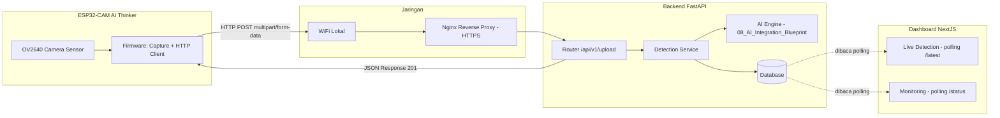
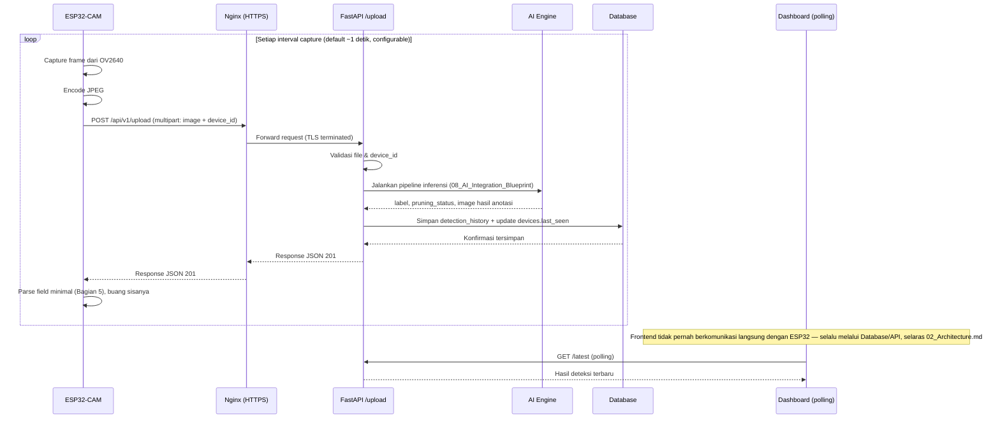
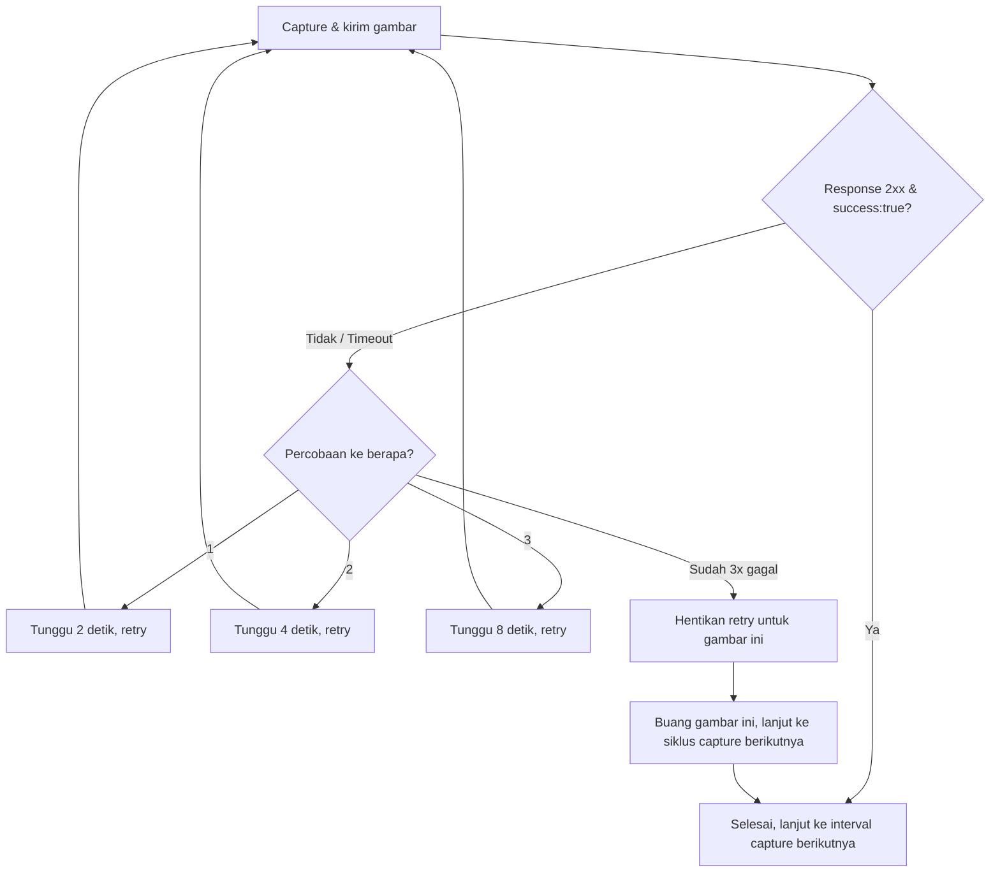
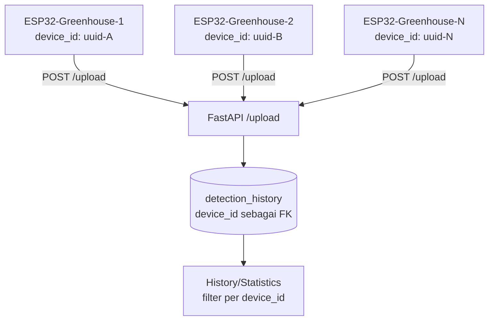
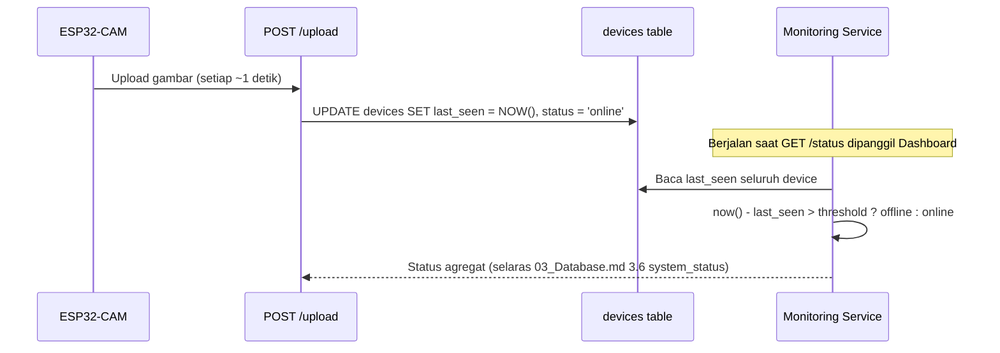

# ESP32 COMMUNICATION BLUEPRINT
## Sistem Deteksi Tanaman Melon Siap Pangkas (ESP32-CAM AI Thinker ↔ FastAPI)

Acuan: 01_SRS.md, 02_Architecture.md, 03_Database.md, 04_API.md, 05_UI_UX.md, 06_Backend_Blueprint.md, 07_Frontend_Architecture_Blueprint.md, 08_AI_Integration_Blueprint.md. Tidak ada requirement yang diubah. Dokumen ini adalah blueprint komunikasi hardware↔backend — **belum berisi source code**, baik firmware C/C++ maupun Python.

---

# 1. FILOSOFI KOMUNIKASI

### 1.1 Prinsip Dasar

ESP32-CAM AI Thinker adalah perangkat dengan memori sangat terbatas (520 KB SRAM, 4 MB PSRAM pada varian umum) dan koneksi WiFi yang tidak selalu stabil di lingkungan lapangan (kebun/greenhouse). Filosofi komunikasi dirancang berdasarkan kenyataan ini, bukan berdasarkan asumsi koneksi datacenter yang andal:

| Prinsip | Penerapan |
|---|---|
| **Sederhana di sisi perangkat, cerdas di sisi backend** | ESP32 hanya bertugas: capture → encode JPEG → kirim HTTP POST. Seluruh logic berat (validasi, inferensi AI, rule engine status pangkas) berada di backend — selaras 02_Architecture.md yang menempatkan ESP32 sebagai sumber data searah, bukan node cerdas |
| **Stateless dari sisi ESP32** | ESP32 tidak menyimpan riwayat, tidak menyimpan token sesi jangka panjang, tidak perlu tahu hasil deteksi sebelumnya — setiap request berdiri sendiri, menyederhanakan firmware dan menghindari state yang dapat korup saat reboot/brownout |
| **Tidak ada koneksi persisten** | Sesuai batasan SRS 1.3, tidak ada WebSocket/MJPEG streaming — seluruh komunikasi berbasis request-response HTTP diskrit, sehingga ESP32 tidak perlu menjaga koneksi tetap terbuka (lebih hemat memori dan lebih tahan terhadap WiFi yang sempat putus-nyambung) |
| **Predictable failure** | Firmware dirancang mengasumsikan kegagalan jaringan adalah hal normal yang akan terjadi (bukan kondisi luar biasa), sehingga retry & timeout bukan fitur tambahan, melainkan bagian inti dari alur utama |
| **Kontrak data tunggal** | Format request/response yang dipakai ESP32 **adalah kontrak yang sama persis** dengan `POST /api/v1/upload` pada 04_API.md — dokumen ini tidak mendefinisikan endpoint atau skema baru, hanya menjelaskan bagaimana firmware mengonsumsi kontrak yang sudah ada secara minimal dan efisien |

### 1.2 Mengapa Tidak Ada Endpoint/Skema Baru

04_API.md sudah menetapkan `POST /api/v1/upload` sebagai satu-satunya pintu masuk ESP32 ke sistem, dengan response sukses (201) yang sudah lengkap mencakup `id`, `device_id`, `label`, `pruning_status`, `image_path`, `inference_time`, `detection_time`. Dokumen ini **tidak mengubah** kontrak tersebut. Yang dijelaskan di sini adalah strategi *konsumsi minimal* di sisi firmware: ESP32 tidak perlu mem-parsing seluruh field response, cukup mengambil subset kecil yang relevan baginya (lihat Bagian 5) — menyederhanakan beban parsing JSON pada mikrokontroler tanpa mengubah struktur API yang sudah disepakati lintas dokumen.

---

# 2. ARSITEKTUR KOMUNIKASI



### 2.1 Alur End-to-End



Frontend dan ESP32 **tidak pernah saling mengetahui keberadaan satu sama lain** secara langsung — keduanya hanya berbicara dengan backend, masing-masing melalui kontrak yang berbeda (`/upload` untuk ESP32, `/latest` `/status` untuk Dashboard). Pemisahan ini memastikan perubahan pada salah satu sisi (mis. firmware ESP32 diperbarui) tidak pernah berdampak langsung pada sisi lain.

---

# 3. CAPTURE IMAGE

| Aspek | Keputusan |
|---|---|
| **Kapan gambar diambil** | Secara periodik berdasarkan timer internal firmware, **bukan** dipicu oleh kondisi/hasil deteksi sebelumnya — sesuai SRS 1.2 ("ESP32-CAM menangkap gambar tanaman secara periodik tanpa intervensi manual"). ESP32 tidak memiliki logic untuk menilai "apakah ada objek menarik"; keputusan deteksi sepenuhnya didelegasikan ke AI Engine di backend (selaras 02_Architecture.md: ESP32 adalah sumber data, bukan node cerdas) |
| **Format gambar** | JPEG — format native sensor OV2640 pada ESP32-CAM, dipilih karena (1) encoding JPEG dilakukan langsung oleh hardware DCMI/sensor tanpa membebani CPU ESP32 untuk konversi format lain, (2) ukuran file jauh lebih kecil dibanding format mentah (BMP/RAW) yang tidak mungkin dikirim setiap detik melalui WiFi terbatas, (3) selaras validasi backend pada 04_API.md yang menerima `.jpg/.jpeg/.png` |
| **Resolusi yang direkomendasikan** | **VGA (640×480)** sebagai baseline. Pertimbangan: (a) cukup detail untuk objek kecil seperti tunas air dan ujung daun pada jarak kamera tipikal di greenhouse, (b) ukuran file JPEG hasil VGA pada kualitas 80–85% umumnya berada di kisaran puluhan-ratusan KB — jauh di bawah batas 5 MB pada 04_API.md dan realistis dikirim tiap ~1 detik tanpa membebani bandwidth WiFi lokal, (c) cukup ringan untuk dialokasikan di PSRAM ESP32-CAM tanpa risiko *out-of-memory* saat encoding. Resolusi lebih tinggi (SVGA/UXGA) dapat dipertimbangkan jika hasil pengujian lapangan menunjukkan detail objek kurang memadai, namun perlu diuji ulang terhadap interval capture dan beban inferensi backend (lihat Bagian 11) |
| **Kualitas JPEG** | 80–85 (skala 0–100 encoder kamera) — titik tengah antara ukuran file dan kejelasan visual yang dibutuhkan baik oleh AI Engine (preprocessing tetap me-resize ke ukuran input model, sesuai 08_AI_Integration_Blueprint Bagian 5) maupun oleh kebutuhan tampilan gambar besar di Dashboard (05_UI_UX.md) |
| **Interval pengiriman** | Default **~1 detik**, sesuai SRS 1.2. Setiap gambar yang berhasil di-capture **selalu dikirim dan selalu memicu pipeline inferensi penuh** di backend — tidak ada mekanisme "kirim hanya jika terdeteksi sesuatu" di sisi ESP32, karena penentuan "ada objek atau tidak" adalah hasil dari inferensi itu sendiri (08_AI_Integration_Blueprint Bagian 7.1), bukan prasyarat sebelum pengiriman. Nilai interval ini **dirancang configurable** melalui `system_configuration.upload_interval` (03_Database.md Bagian 3.8) — bukan hardcoded di firmware sebagai angka tetap selamanya, agar dapat disesuaikan tanpa flashing ulang firmware jika observasi lapangan/beban VPS menuntut penyesuaian (lihat Bagian 11) |

---

# 4. UPLOAD

### 4.1 Spesifikasi Request

| Aspek | Nilai |
|---|---|
| **Endpoint** | `POST /api/v1/upload` (selaras 04_API.md Bagian 4.1) |
| **Content-Type** | `multipart/form-data; boundary=<auto-generated>` |
| **Header tambahan** | `X-Device-Key: <device_api_key>` (lihat Bagian 10 — mekanisme autentikasi perangkat) |
| **Timeout koneksi (sisi ESP32)** | Lihat Bagian 6 |

### 4.2 Struktur Multipart Form

| Field | Tipe | Wajib | Keterangan |
|---|---|---|---|
| `image` | file (binary JPEG) | Ya | Hasil capture sesuai Bagian 3 |
| `device_id` | string (UUID) | Ya | Identitas perangkat terdaftar di tabel `devices` (03_Database.md), selaras 04_API.md Bagian 4.1 |

### 4.3 Mengapa Tidak Mengirim Field Tambahan

Firmware **tidak** mengirim field seperti timestamp capture, resolusi, atau metadata sensor lain — backend sudah mencatat `detection_time` saat request diterima (cukup akurat untuk kebutuhan riset sesuai SRS 1.4), dan resolusi/format dapat diturunkan langsung dari file gambar itu sendiri di Image Validator (08_AI_Integration_Blueprint Bagian 5) jika suatu saat dibutuhkan. Mengurangi jumlah field yang wajib disusun firmware berarti mengurangi titik potensial kesalahan parsing/encoding di sisi mikrokontroler.

### 4.4 Device ID: Sumber & Penyimpanan di Firmware

`device_id` (UUID, sesuai `devices.id` pada 03_Database.md) bersifat **statis per unit fisik** — ditentukan saat provisioning awal oleh Administrator (selaras prinsip "tidak ada registrasi publik" pada SRS 1.3, yang berlaku konsisten baik untuk user maupun device) dan disimpan di firmware (mis. tertanam saat build, atau disimpan di NVS/flash partition khusus konfigurasi agar dapat diubah tanpa kompilasi ulang penuh bila unit dipindah/diganti). ESP32 tidak pernah men-generate `device_id` sendiri secara acak — UUID harus sudah terdaftar lebih dulu di tabel `devices`, karena 04_API.md menetapkan request dengan `device_id` tidak terdaftar akan ditolak (`404`).

---

# 5. RESPONSE

### 5.1 Subset Field yang Diproses Firmware

Response sukses (201) `POST /api/v1/upload` pada 04_API.md memuat field lengkap untuk kebutuhan backend/penelitian. Firmware **hanya perlu mem-parsing 4 field berikut**, sisanya diabaikan (tidak perlu di-deserialize):

```json
{
  "success": true,
  "message": "Deteksi berhasil diproses",
  "data": {
    "label": "buah_siap",
    "pruning_status": "siap_pangkas",
    "detection_time": "2026-06-30T10:15:00Z"
  }
}
```

| Field yang Dibaca Firmware | Setara dengan Field 04_API.md | Kegunaan di Sisi ESP32 |
|---|---|---|
| `success` | `success` | Menentukan apakah siklus capture-upload dianggap selesai (lanjut ke interval berikutnya) atau perlu retry (Bagian 6) |
| `message` | `message` | Opsional — dapat ditulis ke serial log lokal untuk debugging lapangan tanpa perlu membuka Dashboard |
| `label` | `data.label` | Opsional ditampilkan ke indikator lokal (mis. LED status), jika perangkat dilengkapi indikator fisik di masa depan |
| `status_pangkas` | `data.pruning_status` | Sama seperti di atas — penamaan `status_pangkas` dipakai di dokumen ini agar konsisten dengan istilah domain SRS/UI ("Status Pangkas"), namun field JSON aktual tetap `pruning_status` sesuai 04_API.md, tidak ada penamaan ganda di backend |
| `timestamp` | `data.detection_time` | Dapat dipakai firmware untuk sinkronisasi jam lokal (RTC ESP32 sering drift tanpa NTP) sebagai efek samping yang berguna, bukan tujuan utama desain |

### 5.2 Alasan Pemilihan Format

| Alasan | Penjelasan |
|---|---|
| **Konsisten dengan kontrak API yang sudah ada** | Tidak ada skema ganda untuk dipelihara — backend tetap mengembalikan satu bentuk response yang sama ke ESP32 maupun ke klien lain yang memanggil `/upload`, selaras prinsip "Predictable" pada 04_API.md Bagian 1.2 |
| **Flat, bukan nested dalam (untuk field yang dibaca firmware)** | `label`, `pruning_status`, `detection_time` berada satu level di dalam `data`, sehingga parsing JSON di firmware (umumnya menggunakan pustaka ringan seperti ArduinoJson) hanya memerlukan dua langkah akses (`data["label"]`), tidak perlu traversal struktur kompleks |
| **`success` sebagai boolean eksplisit** | Firmware tidak perlu menebak keberhasilan dari status HTTP semata (yang kadang ambigu jika tertukar oleh proxy/timeout) — boolean eksplisit di body memberi sinyal tegas yang sama persis dengan yang dipakai Frontend (07_Frontend_Architecture_Blueprint.md), menjaga interpretasi sukses/gagal identik di seluruh klien sistem |
| **Tidak menyertakan confidence/skor internal** | Selaras SRS 1.3 dan 08_AI_Integration_Blueprint Bagian 1.2 — confidence tidak pernah keluar dari backend ke klien manapun, termasuk ke ESP32 |
| **Ukuran response kecil** | Karena hanya subset field yang dibutuhkan firmware, payload JSON yang diparsing aktif berukuran sangat kecil (puluhan byte), meminimalkan waktu alokasi buffer JSON di memori terbatas ESP32 |

---

# 6. TIMEOUT & RETRY

### 6.1 Timeout

| Tahap | Nilai yang Direkomendasikan | Alasan |
|---|---|---|
| **Koneksi TCP/TLS ke server** | 5 detik | Cukup untuk jaringan WiFi lokal yang sehat; jika lebih lama, kemungkinan besar access point/internet sedang bermasalah, lebih baik gagal cepat dan retry daripada menahan resource ESP32 menunggu |
| **Pengiriman body (upload gambar)** | 10 detik | Mengakomodasi ukuran file VGA JPEG (puluhan-ratusan KB) pada WiFi yang mungkin lemah sinyal, tanpa menunggu tanpa batas |
| **Menunggu response (termasuk waktu inferensi backend)** | 15 detik | Mengakomodasi waktu inferensi AI Engine + I/O database di VPS 1 vCPU (08_AI_Integration_Blueprint mencatat durasi inferensi sebagai metrik, sehingga nilai ini sebaiknya ditinjau ulang berdasarkan data `inference_time` aktual setelah sistem berjalan) |
| **Total timeout per percobaan** | ±20–25 detik | Gabungan ketiga tahap di atas, cukup ketat agar tidak menahan siklus capture berikutnya terlalu lama jika satu request bermasalah |

### 6.2 Strategi Retry — Exponential Backoff Sederhana



| Aspek | Keputusan |
|---|---|
| **Jumlah maksimum retry** | 3 kali per gambar — dipilih agar tidak menumpuk antrian gambar gagal yang justru memperlambat siklus capture berikutnya pada perangkat dengan memori terbatas |
| **Basis backoff** | `delay = base_delay × 2^attempt` dengan `base_delay = 2 detik` (2s → 4s → 8s) — sederhana untuk diimplementasikan di firmware tanpa pustaka tambahan, namun tetap memberi jeda yang memperbesar peluang server pulih sebelum percobaan berikutnya |
| **Gambar yang gagal setelah retry maksimum** | **Dibuang**, tidak disimpan ke flash lokal untuk dikirim ulang nanti — keputusan ini konsisten dengan filosofi "stateless dari sisi ESP32" (Bagian 1.1) dan keterbatasan storage ESP32-CAM (umumnya tanpa SD card terpasang dalam skenario ini); kehilangan satu-dua frame pada interval ~1 detik dianggap dapat diterima mengingat sifat data yang kontinu, bukan satu kejadian unik yang tidak terulang |
| **Tidak ada antrian/buffer multi-gambar** | Firmware tidak menyimpan banyak gambar pending sekaligus — jika capture berikutnya sudah waktunya sementara retry gambar sebelumnya masih berjalan, retry gambar lama dihentikan (diprioritaskan gambar terbaru), karena nilai data deteksi real-time menurun seiring waktu tunda |

### 6.3 Server Tidak Dapat Dijangkau (Total Failure)

Jika seluruh siklus retry gagal berturut-turut dalam jumlah signifikan (mis. 10 siklus capture berturut-turut tanpa satu pun berhasil — menandakan masalah jaringan/server yang lebih lama dari sekadar gangguan sesaat), firmware masuk ke **mode degradasi**: interval capture diperlebar sementara (mis. dua kali lipat dari normal) untuk menghemat daya dan mengurangi log kegagalan yang tidak berguna, sambil tetap mencoba secara berkala — bukan berhenti total, karena perangkat tidak memiliki cara lain untuk mengetahui kapan harus mencoba lagi selain mencoba secara periodik.

---

# 7. DEVICE IDENTIFICATION

### 7.1 Mekanisme

- Setiap unit fisik ESP32-CAM diwakili oleh satu baris di tabel `devices` (03_Database.md Bagian 3.2), diidentifikasi melalui `device_id` (UUID) yang dikirim pada setiap request `/upload`.
- `device_id` ditetapkan **sekali saat provisioning** (oleh Administrator, bukan oleh perangkat sendiri) dan tidak berubah sepanjang umur perangkat kecuali terjadi penggantian unit fisik.
- `serial_number` pada tabel `devices` berfungsi sebagai identitas fisik independen dari `device_id` (mis. untuk pelacakan inventaris/garansi hardware), terpisah dari identitas logis yang dipakai komunikasi API — keduanya sengaja dipisah agar penggantian unit fisik (serial number baru) dapat tetap mempertahankan `device_id` & riwayat data yang sama jika diperlukan, atau sebaliknya.

### 7.2 Dukungan Multi-Device Sejak Awal



Karena `device_id` sudah menjadi parameter wajib sejak desain awal `/upload` (04_API.md) dan sudah menjadi foreign key di `detection_history` (03_Database.md Bagian 8), penambahan unit ESP32 baru di masa depan **tidak memerlukan perubahan apa pun** pada endpoint, skema database, maupun arsitektur komunikasi — cukup menambah satu baris baru di tabel `devices` melalui proses provisioning Administrator, lalu menanamkan `device_id` tersebut ke firmware unit baru.

---

# 8. MONITORING

### 8.1 Pendekatan Saat Ini: Heartbeat Pasif (via Traffic Upload)

Sesuai SRS 1.3 yang melarang koneksi realtime persisten, sistem **tidak menggunakan endpoint heartbeat terpisah** pada tahap ini. Status online/offline ESP32 diturunkan secara pasif dari aktivitas `/upload` yang sudah ada:



| Aspek | Keputusan |
|---|---|
| **Update `last_seen`** | Setiap request `/upload` yang berhasil diterima (terlepas dari hasil inferensinya sukses/gagal) memperbarui `devices.last_seen` dan `devices.status = online` — keberhasilan *menerima* request sudah cukup sebagai bukti perangkat hidup, tidak perlu menunggu seluruh pipeline AI selesai |
| **Ambang offline** | Device dianggap `offline` jika `now() - last_seen` melebihi beberapa kali lipat interval capture normal (mis. 3–5× `upload_interval` dari `system_configuration`) — memberi toleransi untuk satu-dua siklus retry yang gagal (Bagian 6) tanpa langsung dianggap offline secara prematur |
| **Siapa yang mengevaluasi ambang** | Monitoring Service (06_Backend_Blueprint.md Bagian 8), dijalankan saat `GET /status` dipanggil Dashboard (polling, selaras 07_Frontend_Architecture_Blueprint.md `useMonitoring`) — bukan proses background terus-menerus, menghindari beban tambahan pada VPS 1 vCPU |
| **Kelebihan pendekatan ini** | Tidak menambah traffic/endpoint baru sama sekali — memanfaatkan data yang sudah pasti dikirim ESP32 setiap siklus, selaras prinsip "sederhana" pada Bagian 1 |
| **Keterbatasan pendekatan ini** | Jika `upload_interval` diperlebar sangat jauh (mis. dikonfigurasi ulang menjadi setiap beberapa menit di masa depan), deteksi offline menjadi kurang responsif karena bergantung penuh pada frekuensi upload — keterbatasan ini dapat diterima saat ini mengingat interval default ~1 detik (SRS 1.2), namun perlu diperhatikan jika konfigurasi berubah signifikan |

### 8.2 Rancangan Pengembangan Berikutnya: Endpoint Heartbeat Terpisah

Jika di masa depan dibutuhkan deteksi offline yang lebih cepat/independen dari siklus upload gambar (mis. ESP32 berhenti capture karena sensor kamera rusak namun WiFi & MCU masih hidup — kondisi yang tidak akan pernah terdeteksi oleh pendekatan pasif di atas), dapat ditambahkan:

| Komponen | Rancangan |
|---|---|
| **Endpoint baru** | `POST /api/v1/heartbeat` (menyusul prinsip versioning non-breaking 04_API.md Bagian 14 — penambahan endpoint baru tidak memerlukan versi API baru) |
| **Payload** | Sangat minim: hanya `device_id` (tanpa gambar), agar ringan dan dapat dikirim lebih sering daripada siklus capture-upload tanpa membebani bandwidth/CPU AI Engine |
| **Frekuensi** | Independen dari interval capture gambar — dapat lebih sering (mis. setiap 5–10 detik) karena tidak memicu pipeline AI sama sekali, hanya `UPDATE devices.last_seen` |
| **Dampak ke arsitektur** | Tidak mengubah struktur utama — Monitoring Service yang sudah ada hanya perlu sumber `last_seen` tambahan (dari heartbeat, bukan hanya dari upload), Detection Service tetap tidak berubah |

---

# 9. ERROR HANDLING

| Skenario | Penyebab Umum | Penanganan di Firmware |
|---|---|---|
| **Upload gagal (HTTP non-2xx)** | Server menolak request (validasi gagal, device tidak terdaftar, dst — sesuai status code 04_API.md Bagian 10) | Masuk siklus retry (Bagian 6.2); jika error adalah `404` (`device_id` tidak terdaftar) atau `400` (format tidak didukung), retry tidak akan pernah berhasil karena penyebabnya bukan masalah jaringan — firmware tetap mengikuti siklus retry standar yang sama (sederhana, sesuai filosofi Bagian 1), namun developer disarankan memantau log untuk membedakan kegagalan persisten semacam ini saat debugging lapangan |
| **Gambar rusak (gagal di-encode kamera)** | Sensor OV2640 mengembalikan frame korup/kosong (kadang terjadi pada modul ESP32-CAM murah, terutama setelah restart) | Firmware melakukan validasi minimal di sisi lokal sebelum mengirim (mis. cek ukuran buffer JPEG > 0 dan header JPEG valid `FFD8...FFD9`) — jika gagal, **tidak dikirim sama sekali**, langsung capture ulang pada siklus berikutnya tanpa menghabiskan kuota retry jaringan untuk data yang sudah pasti akan ditolak backend (`InvalidFileError`, 08_AI_Integration_Blueprint Bagian 5) |
| **Respons tidak valid (bukan JSON / JSON tidak lengkap)** | Proxy/gateway mengembalikan halaman error HTML (mis. Nginx 502/504 saat backend down), atau koneksi terputus di tengah penerimaan body response | Firmware memperlakukan kegagalan parsing JSON sama seperti kegagalan request — masuk siklus retry; tidak mencoba "menebak" makna dari response yang tidak terstruktur |
| **Server timeout** | VPS sedang beban tinggi (proses inferensi lain berjalan bersamaan), atau jaringan lambat | Lihat Bagian 6.1 — timeout per tahap sudah didefinisikan eksplisit agar firmware tidak menunggu tanpa batas |
| **Koneksi internet/WiFi terputus** | Access point lokal mati, gangguan ISP, ESP32 keluar jangkauan WiFi | Firmware mendeteksi kegagalan koneksi WiFi sebelum mencoba HTTP (cek status WiFi station), langsung masuk siklus retry/backoff tanpa mencoba membuka koneksi TCP yang pasti gagal; jika WiFi terputus lebih dari ambang waktu tertentu, firmware mencoba reconnect WiFi (bukan sekadar retry HTTP) sebelum melanjutkan siklus upload |

**Prinsip umum:** seluruh kegagalan di atas **tidak pernah menghentikan firmware secara permanen** — siklus capture-upload selalu kembali berjalan pada interval berikutnya, selaras filosofi "predictable failure, bukan kondisi luar biasa" (Bagian 1.1).

---

# 10. SECURITY

### 10.1 Pendekatan Saat Ini (Sesuai Ruang Lingkup Proyek)

04_API.md Bagian 15 sudah mencatat bahwa `/upload` perlu diamankan menggunakan mekanisme terpisah dari Bearer Token user (karena ESP32 tidak melalui flow `/login`), dengan detail diserahkan ke tahap Security Specification — dokumen ini mengisi keputusan tersebut:

| Lapisan | Mekanisme | Alasan |
|---|---|---|
| **Transport** | HTTPS, dengan SSL termination di Nginx (selaras 02_Architecture.md Bagian 6 — Nginx sudah ditetapkan sebagai reverse proxy tunggal yang menangani SSL) | Mencegah gambar mentah dan response terbaca dalam bentuk plain-text di jaringan lokal; ESP32 cukup memverifikasi sertifikat menggunakan root CA bundle standar (mis. ISRG Root X1 jika memakai Let's Encrypt), yang didukung pustaka HTTPClient ESP32 standar tanpa kebutuhan resource tambahan signifikan |
| **Identitas perangkat** | `device_id` (UUID) — divalidasi backend terhadap tabel `devices`; request dengan `device_id` tak terdaftar ditolak `404` (selaras 04_API.md) | Lapisan dasar yang sudah ada — mencegah data masuk atas nama device yang tidak dikenal sistem |
| **Otentikasi perangkat (usulan tambahan)** | **Device API Key** statis per perangkat, dikirim via header `X-Device-Key`, divalidasi backend terhadap nilai yang disimpan di kolom baru pada tabel `devices` (mis. `api_key_hash`, disimpan sebagai hash bukan plaintext — mengikuti pola `password_hash` pada tabel `users`, 03_Database.md Bagian 3.1) | Mencegah pihak luar mengirim data deteksi palsu hanya dengan menebak/mengetahui `device_id` (yang bukan rahasia — UUID device bisa saja terlihat di traffic jika tidak dienkripsi sebelumnya, atau bocor saat debugging). Penambahan kolom ini bersifat *additive* (nullable, opsional diaktifkan), tidak mengubah struktur tabel `devices` yang sudah ada, selaras pola penambahan kolom non-breaking pada 03_Database.md |

### 10.2 Mengapa Tidak Memakai Skema yang Lebih Kompleks Saat Ini

Pendekatan seperti mTLS (mutual TLS, sertifikat klien per device) atau OAuth device flow sengaja **tidak** dipakai pada tahap ini:
- Beban implementasi sertifikat klien per unit di ESP32 (manajemen rotasi, penyimpanan kunci privat di flash yang tidak selalu terenkripsi) tidak sepadan dengan profil risiko sistem riset skala kecil ini (jaringan lokal greenhouse, bukan endpoint publik internet terbuka berisiko tinggi).
- Device API Key statis + HTTPS sudah menutup celah utama (penyamaran identitas device, sniffing data di jaringan) tanpa kompleksitas tambahan yang justru meningkatkan risiko kesalahan implementasi pada firmware dengan resource terbatas.

### 10.3 Jalur Peningkatan di Masa Depan

| Peningkatan | Pemicu | Dampak ke Arsitektur |
|---|---|---|
| **Rotasi Device API Key berkala** | Jika ditemukan indikasi kebocoran key | Tidak mengubah struktur — hanya proses operasional (Administrator generate key baru, update di backend & flash ulang firmware) |
| **mTLS per device** | Jika sistem diperluas ke jaringan yang lebih terbuka/tidak tepercaya | Lapisan tambahan di atas HTTPS yang sudah ada di Nginx; `/upload` tetap menerima kontrak data yang sama |
| **OTA Update terenkripsi & signed firmware** | Lihat Bagian 13 | Mekanisme terpisah dari komunikasi data deteksi, tidak mengubah alur `/upload` |
| **Rate limiting per device** | Jika ditemukan device yang mengirim request abnormal (indikasi malfungsi/disalahgunakan) | Diterapkan di level Nginx/Middleware (06_Backend_Blueprint.md Bagian 13), tidak memerlukan perubahan firmware |

---

# 11. PERFORMANCE

| Strategi | Penerapan |
|---|---|
| **Ukuran gambar** | Resolusi VGA (Bagian 3) dipilih agar setiap request tetap jauh di bawah batas 5 MB (04_API.md) dan realistis dikirim pada interval pendek tanpa menumpuk antrian jaringan |
| **Frekuensi upload** | Default ~1 detik (SRS 1.2), namun **configurable** via `system_configuration.upload_interval` (03_Database.md 3.8) — memberi jalan keluar operasional jika observasi menunjukkan VPS 1 vCPU kesulitan mengimbangi beban inferensi pada frekuensi setinggi itu secara sustained, tanpa perlu mengubah firmware/flashing ulang, cukup mengubah nilai konfigurasi dari Dashboard Admin |
| **Penggunaan bandwidth** | Dengan ukuran file VGA JPEG kualitas 80–85 (umumnya puluhan-ratusan KB) dan interval ~1 detik, estimasi throughput per device berada pada kisaran ratusan Kbps — wajar untuk WiFi lokal 2.4GHz standar, namun perlu diperhitungkan ulang secara linear jika jumlah device bertambah (Multi Device, Bagian 13) karena beban bandwidth & inferensi backend bertambah proporsional |
| **Latensi** | Latensi end-to-end yang dirasakan ESP32 (capture → response diterima) didominasi oleh waktu inferensi AI Engine di backend (dicatat sebagai `inference_time`, 08_AI_Integration_Blueprint Bagian 6.3), bukan oleh transport jaringan lokal — firmware tidak perlu real-time strict, karena hasil deteksi dikonsumsi Dashboard melalui polling `/latest` yang juga tidak realtime ketat (selaras SRS 1.3) |
| **Tidak ada kompresi/transformasi tambahan di ESP32** | Firmware tidak melakukan resize/preprocessing sebelum upload — gambar dikirim dalam resolusi capture aslinya (VGA), karena resize untuk kebutuhan model dilakukan di backend (08_AI_Integration_Blueprint Bagian 5), bukan di edge device; ini sengaja menjaga firmware tetap ringan dan memastikan satu sumber kebenaran untuk logic preprocessing (tidak terduplikasi di dua tempat yang berisiko tidak sinkron) |
| **Toleransi terhadap kehilangan frame** | Karena data bersifat kontinu (capture tiap ~1 detik) dan gambar gagal dibuang setelah retry maksimum (Bagian 6.2), sistem tidak dirancang untuk menjamin *zero data loss* — desain ini sengaja mengutamakan kesederhanaan & stabilitas jangka panjang dibanding reliabilitas pengiriman per-frame yang sempurna, sesuai konteks penelitian yang mengandalkan tren data agregat, bukan satu frame tunggal yang kritikal |

---

# 12. TESTING

| Jenis Uji | Skenario | Cara Verifikasi |
|---|---|---|
| **Uji upload berhasil** | Kondisi jaringan normal, `device_id` terdaftar, gambar valid | Response `201` diterima, field `success/label/pruning_status/timestamp` terbaca benar oleh firmware; data muncul di `GET /history` & `GET /latest` backend |
| **Uji server mati** | Backend FastAPI dihentikan sengaja saat ESP32 sedang aktif mengirim | Firmware masuk siklus retry (Bagian 6.2) hingga maksimum, lalu membuang gambar dan melanjutkan siklus berikutnya tanpa crash/hang; saat server dinyalakan kembali, siklus berikutnya berhasil normal tanpa perlu reboot manual ESP32 |
| **Uji jaringan lambat** | Disimulasikan dengan throttling bandwidth (mis. via router test/proxy pembatas) | Timeout per tahap (Bagian 6.1) terpicu sesuai nilai yang ditetapkan, bukan menggantung tanpa batas; perilaku retry tetap konsisten dengan kondisi jaringan normal yang gagal |
| **Uji gambar tidak valid** | Sensor dipaksa mengembalikan frame korup (mis. simulasi melalui kondisi pencahayaan ekstrem/disconnect sensor sesaat) | Validasi lokal firmware (Bagian 9) mencegah pengiriman gambar korup; jika tetap lolos validasi lokal namun ditolak backend (`400 InvalidFileError`), firmware menangani sebagai kegagalan upload standar, bukan crash |
| **Uji koneksi WiFi terputus-nyambung** | WiFi dimatikan sesaat lalu dinyalakan kembali selama siklus berjalan | Firmware mendeteksi status WiFi, mencoba reconnect sebelum retry HTTP, dan kembali ke siklus normal begitu WiFi pulih, tanpa memerlukan power-cycle manual |
| **Uji multi-device bersamaan** | Dua atau lebih ESP32 (atau simulasi via script) mengirim `/upload` pada interval tumpang tindih | Backend memproses tiap request berdasarkan `device_id` masing-masing tanpa tabrakan data; `devices.last_seen` ter-update independen per device (selaras Bagian 7–8) |
| **Uji Device API Key tidak valid** | Request dikirim dengan `device_id` valid namun `X-Device-Key` salah/kosong (setelah mekanisme Bagian 10 diaktifkan) | Backend menolak request (status `401`/`403` sesuai desain lanjutan), firmware memperlakukan sebagai kegagalan upload standar — bukan kegagalan yang memerlukan logic khusus tambahan di firmware |
| **Uji konsistensi response time** | Mengukur `inference_time` dan total round-trip pada berbagai kondisi beban VPS | Mendukung kebutuhan riset SRS 1.4 — hasil pengujian ini juga menjadi dasar evaluasi apakah `upload_interval` default ~1 detik perlu disesuaikan di lingkungan produksi nyata |

**Lingkungan uji:** disarankan menyiapkan instance backend staging terpisah (selaras prinsip migration testing pada 03_Database.md Bagian 13) agar pengujian skenario gagal (server mati, jaringan lambat) tidak mengganggu data produksi/penelitian yang sedang berjalan.

---

# 13. FUTURE SCALABILITY

| Kebutuhan Masa Depan | Bagaimana Blueprint Ini Mendukung Tanpa Mengubah Arsitektur Utama |
|---|---|
| **Multi Device** | Sudah menjadi bagian inti desain sejak Bagian 7 — `device_id` wajib di setiap request, sudah menjadi foreign key di database (03_Database.md). Penambahan unit baru murni operasional (provisioning), tidak menyentuh kontrak komunikasi |
| **WebSocket di masa depan** | Jika kelak dibutuhkan push realtime ke Dashboard (menggantikan polling `/latest`), perubahan terjadi sepenuhnya di sisi **Backend↔Frontend** (selaras 06_Backend_Blueprint.md & 07_Frontend_Architecture_Blueprint.md Bagian Future Scalability) — jalur **ESP32→Backend tetap HTTP POST seperti saat ini**, karena ESP32 hanya mengirim data, tidak pernah menjadi konsumen WebSocket; tidak ada perubahan pada firmware sama sekali |
| **MQTT (opsional)** | Dapat ditambahkan sebagai **jalur alternatif paralel**, bukan pengganti — backend dapat menjalankan MQTT broker/subscriber terpisah yang pada akhirnya tetap memanggil Detection Service yang sama (06_Backend_Blueprint.md Bagian 8), sehingga AI Engine & Repository tidak perlu tahu apakah data datang dari HTTP atau MQTT. Berguna jika di masa depan dibutuhkan komunikasi dengan overhead lebih rendah dari HTTP untuk perangkat baterai/low-power, namun **tidak menggantikan** desain HTTP POST yang sudah ditetapkan untuk ESP32-CAM saat ini |
| **HTTPS** | Sudah menjadi bagian desain sejak awal (Bagian 10.1), bukan penambahan di kemudian hari — selaras keputusan Nginx sebagai SSL termination tunggal pada 02_Architecture.md |
| **OTA Update** | Tidak memengaruhi jalur komunikasi data deteksi (`/upload`) sama sekali — OTA dirancang sebagai **endpoint/mekanisme terpisah** (mis. `GET /api/v1/firmware/latest` yang menyediakan metadata versi & URL binary, divalidasi dengan signature/checksum sebelum firmware menerapkannya), berjalan pada siklus yang jauh lebih jarang (mis. dicek sekali per hari, bukan setiap detik) dan independen dari siklus capture-upload utama. Keamanan tambahan untuk OTA (signed firmware, agar device tidak menjalankan firmware yang dimodifikasi pihak tak bertanggung jawab) menjadi pertimbangan terpisah saat fitur ini benar-benar diimplementasikan |

---

*Dokumen ini merupakan hasil Tahap ESP32 Communication Blueprint. Belum ada source code firmware (C/C++ Arduino/ESP-IDF) maupun Python yang dibuat, sesuai instruksi. Siap dijadikan acuan implementasi firmware ESP32-CAM dan penyempurnaan keamanan endpoint `/upload` pada tahap pengembangan berikutnya.*
